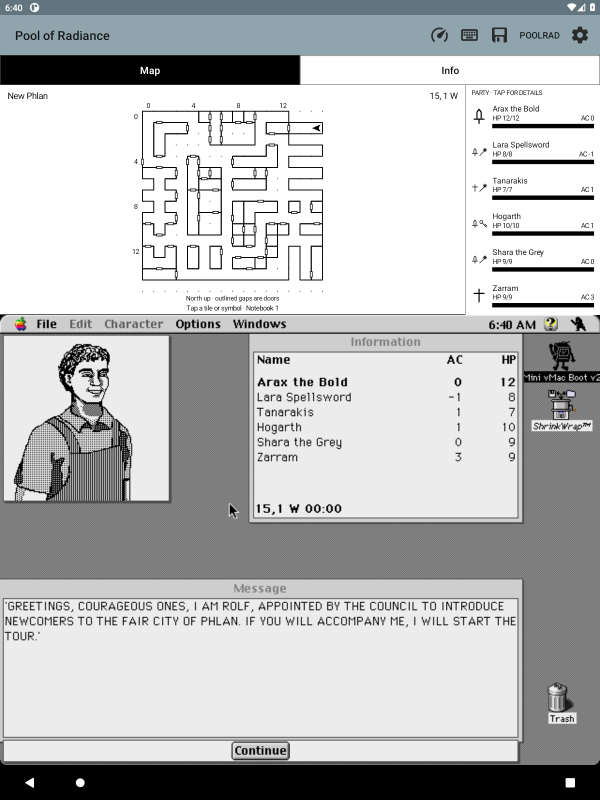
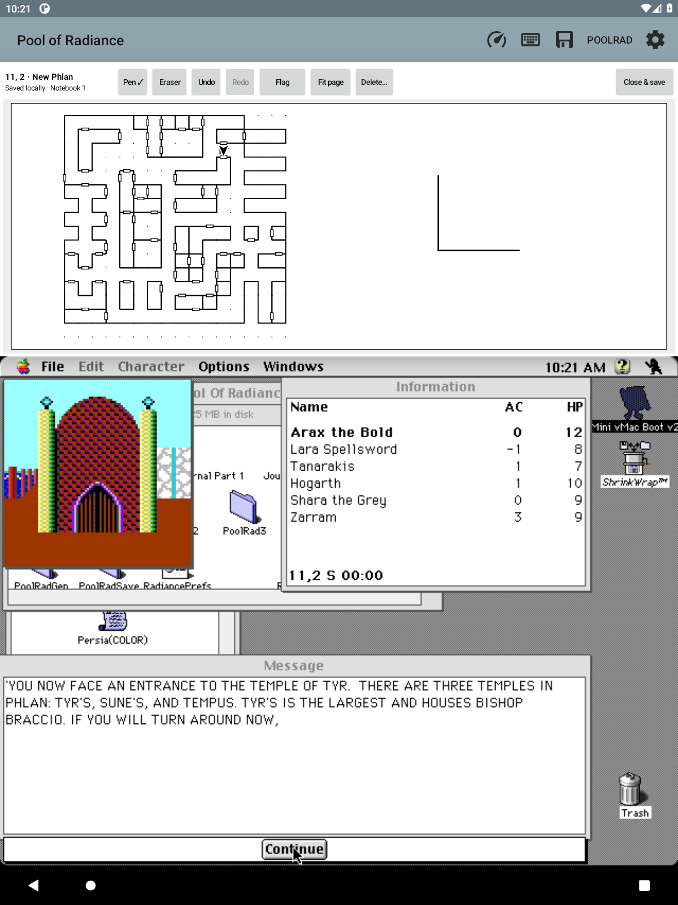

# PoolRad Mac Maps

**Your Macintosh Pool of Radiance adventure, with a live map above it.**

A small Android Mini vMac fork built for playing on an e-ink tablet. The
original game runs unchanged; a monochrome map follows your party directly
from emulated memory. No root, cloud, or separate companion window.

**Inspired by [Gold Box Companion](https://gbc.zorbus.net/), the PC/DOSBox
companion for Pool of Radiance.** Its automapping and convenience features
sparked this project; this is an independent Macintosh/Android implementation,
not a port of its code or an official game release.

  
  

*Captured from the running Android emulator during the opening tour, not mockups or
physical e-ink screenshots. Game artwork belongs to its respective owners.*

## What works

- Live area map with 29 named locations, verified wall/door outlines, coordinates, and facing arrow.
- Stable note identities across map reloads and door-state changes; no guessed area names.
- Remember walked squares, follow directional footprints, or reveal only visited tiles.
- Read recent return directions; exploration stays with your campaign notebook and backups.
- Follow the opening guided tour; clear camp/combat/loading labels keep reference maps honest.
- Party names, HP bars, armor class and class symbols; tap for readable details.
- Tap a tile or symbol for a map-left, writing-right handwritten page.
- Pen, ink-only eraser, undo/redo, autosave, and nine selectable map symbols.
- A larger sketch page with compact title-row tools, finger zoom/pan, and Fit page.
- Separate local notebooks keep different campaigns' notes apart.
- Back up and restore handwriting, map flags, walked tiles, and journal history.
- Map above the Mac display; optional keyboard below; no blinking marker.
- Automatic code-wheel entry for verified prompts; illustrated offline fallback.
- Map/Info tabs; lookup panels fit above the game, even with the keyboard open.
- Offline spells, weapons/armor, class progression, and mixed-coin conversion.
- Offline journal lookup with original illustrations, recent numbers and per-notebook bookmarks; import your own reference book once.
- Link a journal reference to a flag you placed, and check off your own tasks; both ride along in the notebook backup.
- Verified disk checkpoints taken while the Mac is shut down, with an automatic undo copy before any restore.
- Per-level spell readiness in character details: what is castable now, what still needs rest.
- Party conditions at a glance: one quiet badge for injury, unconsciousness, dying, death, petrification, poison or helplessness, with the exact wording on tap.
- Save or share a PNG of the map, game, and optional keyboard together.
- A separate app installation: keep your existing Mini vMac setup.
- Optional private APK: import your bundled starting disks once, then keep saves across updates.
- Preview a quiet Mac desktop or monochrome stonework; restore the original without rolling back saves.

**Early prototype:** verified with Macintosh Pool of Radiance v1.1 in New
Phlan and on the adjoining Slums gate round trip. Other transitions and
dedicated combat/wilderness maps and broader NPC coverage remain unfinished.
The user confirms stylus drawing and two-finger zoom/scroll work well on their
e-ink tablet; rotation, keyboard layout and vendor-specific pen checks remain open.
[Exploration trail](docs/EXPLORATION.md) · [Handwritten notes](docs/NOTEBOOK.md) · [Flag pages & symbols](docs/MAP_INK.md)

## Install

This is an **Android app, not a browser game**. The
[0.18.0 prototype APK](https://github.com/huntergdavis/poolrad-macmaps/releases/tag/v0.18.0)
supports Android 5.0+ and includes the Mac II emulator.

1. [Download the APK](https://github.com/huntergdavis/poolrad-macmaps/releases/download/v0.18.0/poolrad-macmaps-0.18.0.apk) on your tablet.
2. Tap the APK and allow installation from your file manager when prompted.
3. Open **Pool of Radiance** and select your own matching Mac ROM.
4. Import copies of your boot/game disks, launch the game, and load your party.

**Bring your own ROM, Mac system disk, and Macintosh game.** None are in the public APK.
[Step-by-step setup and troubleshooting →](docs/INSTALL.md)

**Read the journal:** [prepare your private reference book](docs/JOURNAL.md),
then choose **Info → Journal → Import journal book**. Includes all 99 numbered
references and 14 original illustrations from the supported Mac documents.
Journal content is not included in the public APK; automatic detection is still planned.

**Keep your notes:** [export a notebook backup](docs/NOTEBOOK_BACKUPS.md) before
uninstalling or clearing app data. Updates install over the existing app.

**One disk, automatic startup:** [combine your own System 7 and game/save
disks](docs/PERSONAL_BOOT.md). The private builder preserves both file forks
and original disks; a normal Mac startup alias launches the game.

**Your own ready-to-play APK:** [bundle those personal files](docs/PERSONAL_PACKAGE.md)
for automatic first-use setup. Later updates never replace your writable disks.
Private builds stay local; the public download remains bring-your-own-files.
An optional [pinned-source build](docs/PERSONAL_ASSET_FETCH.md) can fetch your
explicitly configured inputs once and reuse the verified local cache.

**Quieter desktop:** [preview and apply a background](docs/DESKTOP_APPEARANCE.md)
to the supported System 7.5.5 disk after a normal Mac shutdown. Only desktop
settings change; the original game remains original.

## Project

[Backlog](docs/BACKLOG.md) · [Build/test details](docs/LOCAL_TESTING.md) ·
[Research](docs/RESEARCH.md) · [Design ethos](docs/DESIGN.md) · [Companion tabs](docs/TABS.md)

Built on [Mini vMac for Android](android/UPSTREAM.md) (GPLv2), with DAX/GEO
format work credited to [Gold Box Explorer](licenses/GoldBoxExplorer-MIT.txt)
(MIT). Code-wheel reference: [Dave Kennedy / Andrew Schultz](https://dkennedy.io/por-code-wheel/wwm.html).
All 72 rune pictures are [bundled and credited](licenses/CODE_WHEEL_ARTWORK.md);
no artwork downloads are needed to build or use the app.
