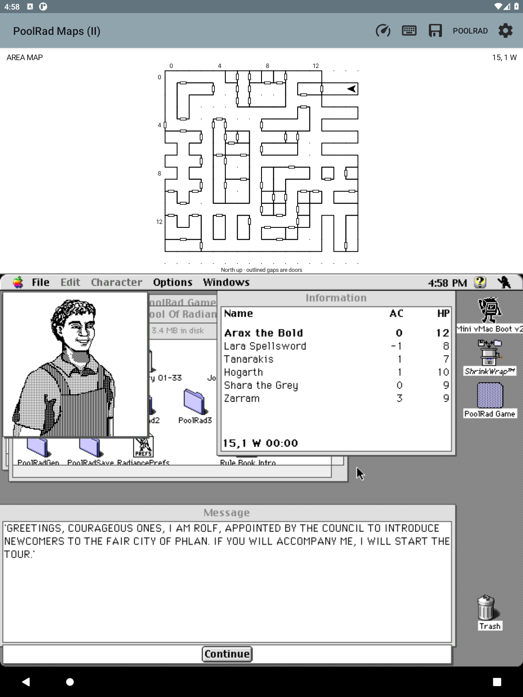
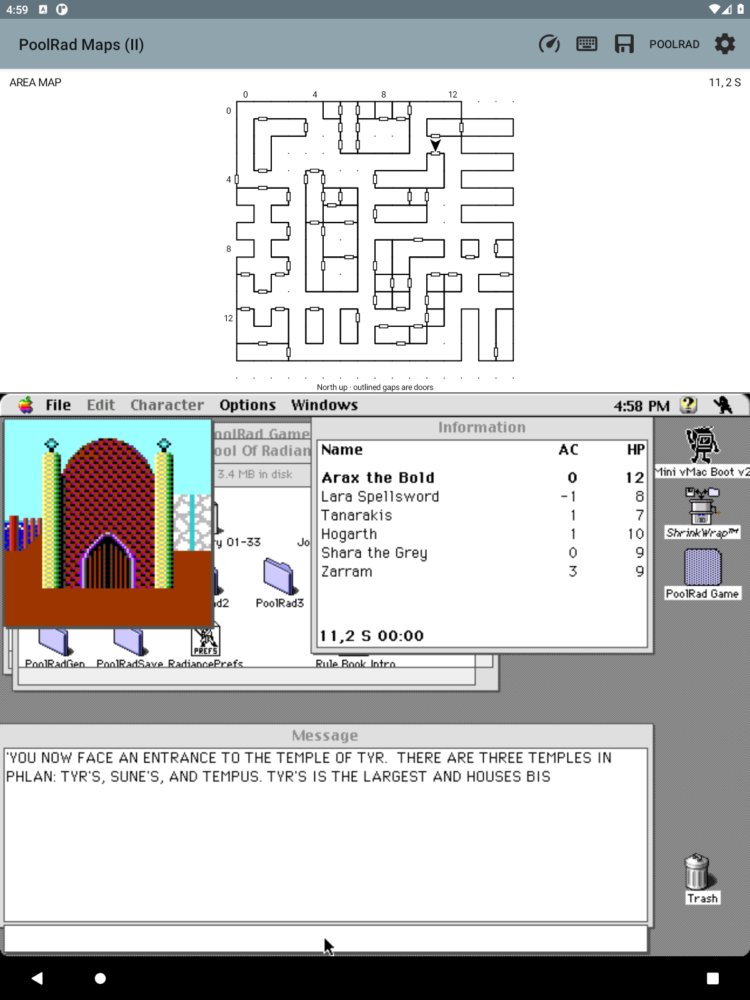

# PoolRad Mac Maps

**Your Macintosh Pool of Radiance adventure, with a live map above it.**

A small Android Mini vMac fork built for playing on an e-ink tablet. The
original game runs unchanged; a monochrome map follows your party directly
from emulated memory. No root, cloud, or separate companion window.

**Inspired by [Gold Box Companion](https://gbc.zorbus.net/), the PC/DOSBox
companion for Pool of Radiance.** Its automapping and convenience features
sparked this project; this is an independent Macintosh/Android implementation,
not a port of its code or an official game release.

  
  

*Actual Android-emulator captures during the opening tour, not mockups or
physical e-ink screenshots. Game artwork belongs to its respective owners.*

## What works

- Live area map with walls, door outlines, coordinates, and facing arrow.
- Map above the Mac display; optional keyboard below; no blinking marker.
- Offline illustrated code wheel that enters the answer and presses Return.
- Upper-half lookup panels that leave the game visible and undimmed.
- A separate app installation: keep your existing Mini vMac setup.

**Early prototype:** verified with Macintosh Pool of Radiance v1.1 in New
Phlan. Broader area transitions and combat/wilderness tracking still need
validation. Handwritten map notes are next, not implemented yet.

## Install

This is an **Android app, not a browser game**. Source is public; a public
prebuilt APK download is not available yet.

1. [Build the APK](docs/INSTALL.md#build-an-apk-from-source), then copy it to your tablet.
2. Tap the APK and allow installation from your file manager when prompted.
3. Open **Pool of Radiance** and select your own matching Mac ROM.
4. Import copies of your boot/game disks, launch the game, and load your party.

**Bring your own ROM, Mac system disk, and Macintosh game.** None are included.
[Step-by-step setup and troubleshooting →](docs/INSTALL.md)

## Project

[Backlog](docs/BACKLOG.md) · [Build/test details](docs/LOCAL_TESTING.md) ·
[Research](docs/RESEARCH.md)

Built on [Mini vMac for Android](android/UPSTREAM.md) (GPLv2), with DAX/GEO
format work credited to [Gold Box Explorer](licenses/GoldBoxExplorer-MIT.txt)
(MIT). Code-wheel reference: [Dave Kennedy / Andrew Schultz](https://dkennedy.io/por-code-wheel/wwm.html).
All 72 rune pictures are [bundled and credited](licenses/CODE_WHEEL_ARTWORK.md);
no artwork downloads are needed to build or use the app.
