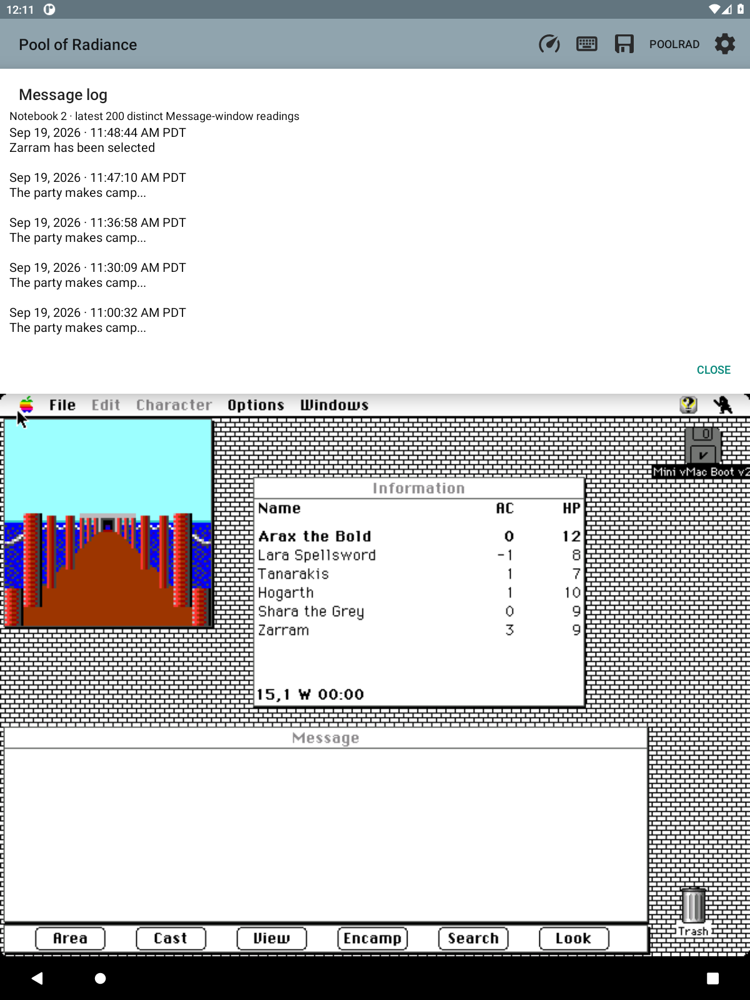
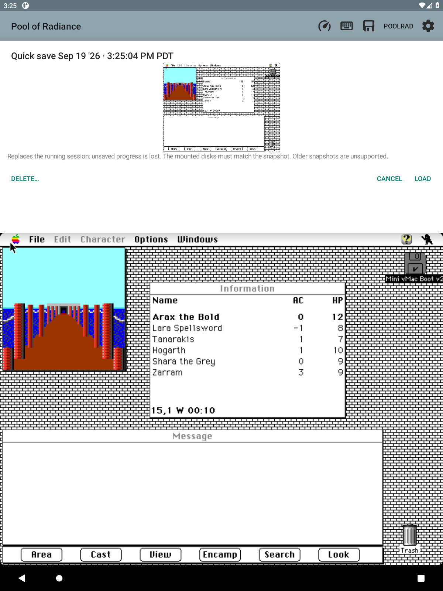
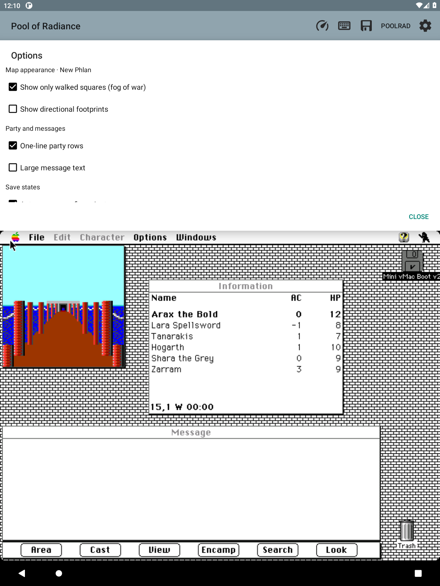

# PoolRad Mac Maps

**Play Macintosh Pool of Radiance on Android, with a live map above the game.**

Built for an e-ink tablet, with party details, handwritten notes and the
adventurer's journal close at hand. Runs in a fork of Mini vMac.
Works offline. No root or account needed.

## Install

[Download the 0.86.0 APK](https://github.com/huntergdavis/poolrad-macmaps/releases/download/v0.86.0/poolrad-macmaps-0.86.0.apk)
for **Android 5.0 or later**.

Features marked **0.87–0.89** below are newer than this download.
Their APKs are not yet published.

1. Tap the APK and allow installation from your file manager when prompted.
2. Open **Pool of Radiance** and select your own matching Macintosh II ROM.
3. Import copies of your Mac system and game disks through the disk menu.
4. Launch the game and load or create your party.

**Bring your own ROM, Mac system disk and Macintosh game.** None are included.
The tested game is **Pool of Radiance v1.1**; keep its original application
name so the map can recognize it.

Updates install over the existing app. Back up your notebooks, game saves and
disks before uninstalling or clearing app data.
[Setup and troubleshooting](docs/INSTALL.md).

## Find your way

- See walls, doors, coordinates, your facing direction and the game's own clock.
  The map recognizes 29 named areas.
- Track walked squares and directional footprints. Marks show doors you have
  not crossed, places you fought and discoveries the app recorded.
- Turn on **fog of war** in **Info → Options** to hide unwalked squares.
  Fog and footprint settings are remembered for each area.
- Tap the map header to highlight your party's square.
- Tap **⏎** in the map's lower-right corner to press Return in the game.
- Open **Info → Map legend** for the symbols.
- **Connections (0.88)** shows passages between
  areas you have visited. Arrows record only the directions you traveled.
  Tap an area to browse its neighbors; **Current area** returns the view to
  your party. Routes stay with your notebook and its backups. Loading a save
  adds no route. [See the Connections view](docs/AREA_CONNECTIONS.md).
- **Exit previews (0.89):** stand on an exit square you have already used to see
  its destination beside your map. Only explored squares appear, even with fog
  off. Tap the preview to browse multiple destinations. Older notebooks gain
  previews as you revisit areas. [See an exit preview](docs/NEIGHBOR_PREVIEW.md).

When your position is unavailable, the app hides the party arrow and labels any
retained map as a reference. Combat has its own overview.

## Check your party

Names, health, armor class and class symbols sit beside the map.
The heading counts anyone hurt, down, waiting for rest or ready to train.

- **Tap a character** for conditions, spells, readied gear, carried weight and
  experience needed for the next level. This also selects them in the game's
  Information window.
- **Hold a character's row** to open their original game sheet.
- **Q** toggles that character's quick combat mode. A busy game queues the change.
- **T** marks someone eligible to train. They still need a suitable training hall.
- **NPC** marks a non-player party member.
- **Info → Marching order** lists everyone from first to last.

*Screenshots from the running app. Game artwork belongs to its respective owners.*

**Info → Money** shows each purse, party coin totals and their gold value.
Gems and jewelry are counted separately. Open the coin converter from this page.

During combat, the overview shows your party and enemies, names the monsters,
and counts those still standing. A ring and a marked party row identify the
acting party member. Tap a party marker to highlight its row. Crosses distinguish
fallen characters who can still be helped from those who are dead or petrified.
Take your combat actions in the original game below.

## Keep a notebook

Tap a map tile to open a page with the map on the left and writing space on
the right.

**New in 0.87:** entering a known area opens its
last-used note, or a page at your arrival square if that note is missing.
Once you start editing, the page stays put until **Close & save**; then the
current area's note opens. You can still use the game beneath an automatically
opened page. [See it in use](docs/AREA_NOTE_FOLLOW.md).

- Draw with a pen or one finger. Use two fingers to zoom and move the page.
- Erase your ink, undo or redo, and choose from nine note symbols. Notes autosave.
- Keep separate notebooks for separate campaigns.
- Open **Info → Notes index** to browse saved notes by area and date.
- Choose **Export all notes as a PDF…** in the index to share your handwriting.
  PDF pages include the area and tile, but not the map's walls.
- Use **PoolRad → Notebooks → Back up everything…** to save all notebooks and
  fog and footprint settings in one file. It includes notes, trails and journal history.
  Game saves, emulator snapshots and disks need separate backups.

[Handwriting guide](docs/NOTEBOOK.md) · [Notebook backups](docs/NOTEBOOK_BACKUPS.md)

## Read without leaving the game

**Info → Journal** includes all 58 journal entries, 18 proclamations,
23 tavern tales and 14 original illustrations. References detected in game
messages collect in your notebook; a **Read** notice opens a new citation.

**Info → Message log** keeps the latest 200 distinct messages the app observed
in the current notebook.

The Info tab also has spells, weapons and armor, and class progression tables.
Code-wheel prompts are answered automatically when recognized, with an
illustrated manual lookup as a fallback.

## Save and resume

- **PoolRad → Quick save** keeps your ten latest quick snapshots.
- **Quick load** immediately restores the newest quick save.
- **Load…** lists quick, named and automatic saves with dates and screen previews.
  Choose one to preview and load.
- **Info → Saves** shows your last loaded or manually saved snapshot, how many
  saves you have, and how much space is left. It estimates how many more saves
  will fit. Use **Load… → Delete…** to remove an old save.
  [See the Saves page](docs/SAVE_STATES.md#f98--info--saves).
- Each snapshot remembers its notebook.
- **Info → Options** controls five-minute autosaves, which keep the latest 20
  automatic snapshots while a party is in the world.

On launch, the app tries to resume your last completed snapshot. Its disks must
match and its notebook must still exist. Otherwise, the Mac boots normally.
Choose **Start normally** to skip the attempt, or turn it off in **Info → Options**.
That page also controls compact party rows and larger game messages.

**Snapshots restore the running Mac, not its disk contents.** Loading requires
the mounted disks to match exactly; a mismatch leaves your current game intact.
Snapshots made before version 0.85 are unsupported.
Original-game saves are unaffected.

Back up original-game saves through **Settings → Back up / restore game saves…**
and keep separate disk backups. Quit the game and use the Mac's normal shutdown
before stopping the emulator; a forced quit can damage a disk.
[Save-state details](docs/SAVE_STATES.md).

## What's still limited

This is a prototype tested with Macintosh Pool of Radiance v1.1.
Tracking has been checked in New Phlan and on the Slums gate round trip.
Full-game area transitions, wilderness maps, the combat arena's full boundaries
and newly recruited NPCs still need work or testing.

Stylus drawing and two-finger zoom/scroll have been tested on a real e-ink
tablet. Rotation and keyboard layout still need checking.
[Current backlog](docs/BACKLOG.md).

## About the project

Inspired by [Gold Box Companion](https://gbc.zorbus.net/).
This is an independent Macintosh/Android project, not a port or an official
game release.

Built on [Mini vMac for Android](android/UPSTREAM.md) (GPLv2).
Game map-format work credits [Gold Box Explorer](licenses/GoldBoxExplorer-MIT.txt)
(MIT). Code-wheel artwork is [bundled and credited](licenses/CODE_WHEEL_ARTWORK.md).

[Build and test](docs/LOCAL_TESTING.md) · [Design](docs/DESIGN.md) ·
[Research](docs/RESEARCH.md) · [Save-file format](docs/SAVE_FORMAT.md) ·
[Personal boot disk](docs/PERSONAL_BOOT.md) · [Personal APK](docs/PERSONAL_PACKAGE.md)
