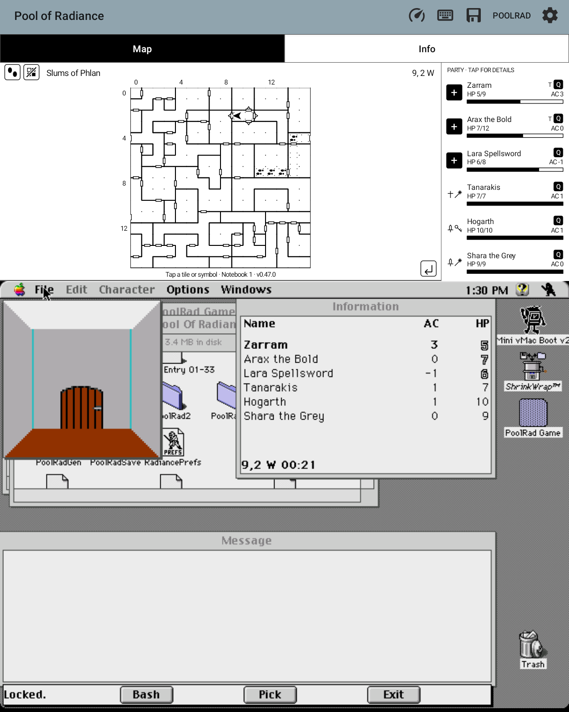
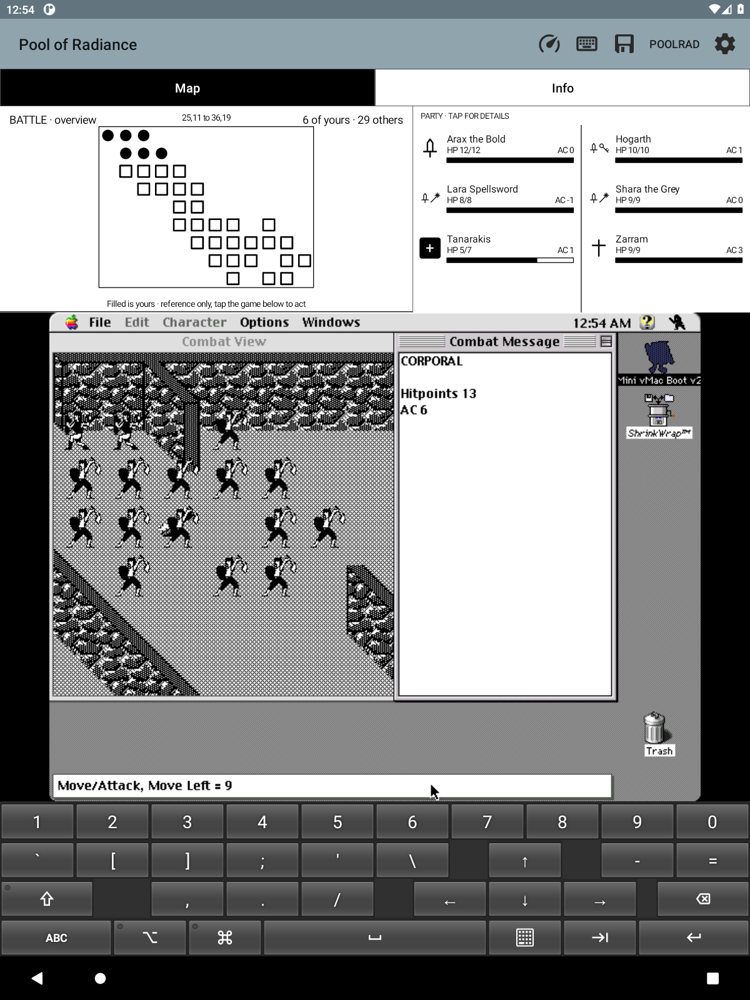
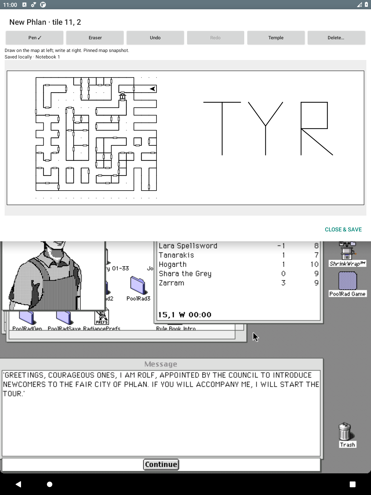
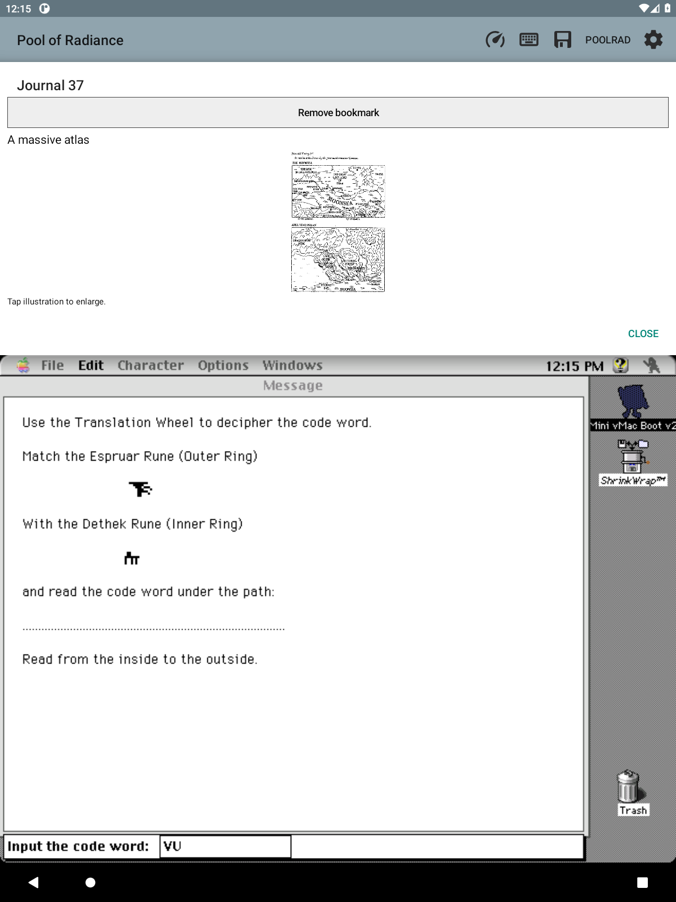

# PoolRad Mac Maps

**Your Macintosh Pool of Radiance adventure, with a live map above it.**

A small Android Mini vMac fork built for playing on an e-ink tablet. The
original game runs unchanged; a monochrome map follows your party directly
from emulated memory. No root, cloud, or separate companion window.

**Inspired by [Gold Box Companion](https://gbc.zorbus.net/), the PC/DOSBox
companion for Pool of Radiance.** Its automapping and convenience features
sparked this project; this is an independent Macintosh/Android implementation,
not a port of its code or an official game release.

*Captured from the running app, not mockups. Game artwork belongs to its respective owners.*

## The map draws itself

Walls, doors, coordinates and your facing arrow, read live from the game's own
memory across 29 named areas — no guessed names. Remember every walked square,
follow directional footprints, or reveal only what you have visited. Camp,
combat and loading states are labelled, so a reference map never lies about
what it is showing.

## Your party, at a glance

Names, HP bars, armor class and class symbols sit beside the map. Tap anyone
for spell readiness per level, readied weapon and armor, carried weight, and
the game's own next-level figures. A quiet badge flags injury, poison, dying or
petrification, with the exact wording on tap — and when a fight starts, a
read-only overview shows every combatant's square.

## Write on the map

Tap any tile for a handwritten page: the map on the left, your writing on the
right. Pen, ink-only eraser, undo/redo, autosave, nine map symbols, and finger
zoom/pan. Separate notebooks keep campaigns apart, and a single backup carries
your handwriting, flags, walked tiles and journal history.

## The whole journal, built in

All 58 journal entries, 18 proclamations, 23 tavern tales and the 14 original
illustrations ship with the app — nothing to import, nothing to look up online.
References the game cites out loud collect themselves into an encountered list,
tappable straight into the reader.

## Also offline

Spells, weapons and armor, class progression and mixed-coin conversion ·
automatic code-wheel entry with an illustrated fallback · save or share a PNG
of the map, game and keyboard together · install alongside your existing Mini
vMac setup.

**Early prototype.** Verified against Macintosh Pool of Radiance v1.1 in New
Phlan and the adjoining Slums gate round trip; other transitions, dedicated
combat and wilderness maps, and broader NPC coverage are unfinished. Testing
happens on a real e-ink tablet, where stylus drawing and two-finger zoom/scroll
work well as of 2026-09-15; rotation and keyboard layout are still unreported.

[Exploration trail](docs/EXPLORATION.md) · [Handwritten notes](docs/NOTEBOOK.md) · [Flag pages & symbols](docs/MAP_INK.md)

## Install

This is an **Android app, not a browser game**. The
[0.30.0 prototype APK](https://github.com/huntergdavis/poolrad-macmaps/releases/tag/v0.30.0)
supports Android 5.0+ and includes the Mac II emulator.

1. [Download the APK](https://github.com/huntergdavis/poolrad-macmaps/releases/download/v0.30.0/poolrad-macmaps-0.30.0.apk) on your tablet.
2. Tap the APK and allow installation from your file manager when prompted.
3. Open **Pool of Radiance** and select your own matching Mac ROM.
4. Import copies of your boot/game disks, launch the game, and load your party.

**Bring your own ROM, Mac system disk, and Macintosh game.** None are in the
public APK. [Step-by-step setup and troubleshooting →](docs/INSTALL.md)

Updates install over the existing app, but
[export a notebook backup](docs/NOTEBOOK_BACKUPS.md) before uninstalling or
clearing app data. Optionally and privately, you can
[combine System 7 and your game disks into one auto-booting disk](docs/PERSONAL_BOOT.md)
and [bundle them into your own ready-to-play APK](docs/PERSONAL_PACKAGE.md);
the public download stays bring-your-own-files.

## Project

[Backlog](docs/BACKLOG.md) · [Build/test details](docs/LOCAL_TESTING.md) ·
[Research](docs/RESEARCH.md) · [Design ethos](docs/DESIGN.md) · [Companion tabs](docs/TABS.md)

Built on [Mini vMac for Android](android/UPSTREAM.md) (GPLv2), with DAX/GEO
format work credited to [Gold Box Explorer](licenses/GoldBoxExplorer-MIT.txt)
(MIT). Code-wheel reference: [Dave Kennedy / Andrew Schultz](https://dkennedy.io/por-code-wheel/wwm.html).
All 72 rune pictures are [bundled and credited](licenses/CODE_WHEEL_ARTWORK.md);
no artwork downloads are needed to build or use the app.
