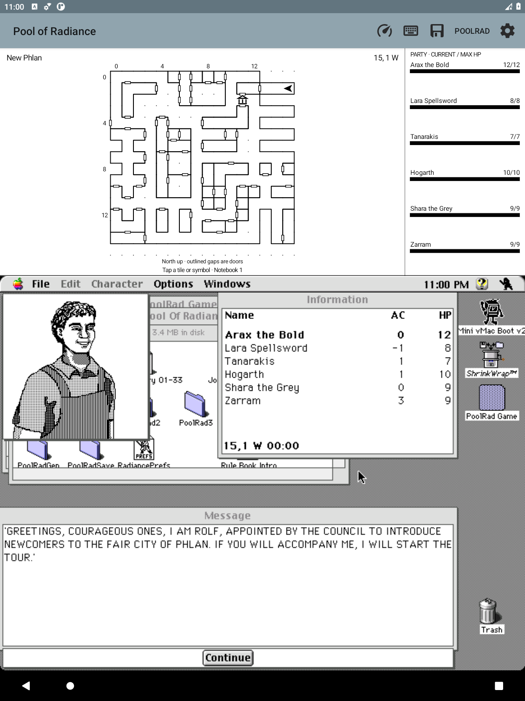

# PoolRad Mac Maps

**Your Macintosh Pool of Radiance adventure, with a live map above it.**

A small Android Mini vMac fork built for playing on an e-ink tablet. The
original game runs unchanged; a monochrome map follows your party directly
from emulated memory. No root, cloud, or separate companion window.

**Inspired by [Gold Box Companion](https://gbc.zorbus.net/), the PC/DOSBox
companion for Pool of Radiance.** Its automapping and convenience features
sparked this project; this is an independent Macintosh/Android implementation,
not a port of its code or an official game release.

  
  

*Captured from the running Android emulator during the opening tour, not mockups or
physical e-ink screenshots. Game artwork belongs to its respective owners.*

## What works

- Live area map with walls, door outlines, coordinates, and facing arrow.
- Party names, current/max HP and monochrome health bars beside the map.
- Tap a tile or symbol for a map-left, writing-right handwritten page.
- Pen, ink-only eraser, undo/redo, autosave, and nine selectable map symbols.
- Separate local notebooks keep different campaigns' notes apart.
- Map above the Mac display; optional keyboard below; no blinking marker.
- Automatic code-wheel entry for verified prompts; illustrated offline fallback.
- Upper-half lookup panels that leave the game visible and undimmed.
- Offline spells, weapons/armor, class progression, and mixed-coin conversion.
- Save or share a PNG of the map, game, and optional keyboard together.
- A separate app installation: keep your existing Mini vMac setup.

**Early prototype:** verified with Macintosh Pool of Radiance v1.1 in New
Phlan and on the adjoining Slums gate round trip. Other transitions and
combat/wilderness tracking still need validation. Notebook backups and physical
stylus polish remain on the backlog.
[Handwritten notes](docs/NOTEBOOK.md) · [Flag pages & symbols](docs/MAP_INK.md)

## Install

This is an **Android app, not a browser game**. The
[0.5.1 prototype APK](https://github.com/huntergdavis/poolrad-macmaps/releases/tag/v0.5.1)
supports Android 5.0+ and includes the Mac II emulator.

1. [Download the APK](https://github.com/huntergdavis/poolrad-macmaps/releases/download/v0.5.1/poolrad-macmaps-0.5.1.apk) on your tablet.
2. Tap the APK and allow installation from your file manager when prompted.
3. Open **Pool of Radiance** and select your own matching Mac ROM.
4. Import copies of your boot/game disks, launch the game, and load your party.

**Bring your own ROM, Mac system disk, and Macintosh game.** None are included.
[Step-by-step setup and troubleshooting →](docs/INSTALL.md)

**One disk, automatic startup:** [combine your own System 7 and game/save
disks](docs/PERSONAL_BOOT.md). The private builder preserves both file forks
and original disks; a normal Mac startup alias launches the game.

## Project

[Backlog](docs/BACKLOG.md) · [Build/test details](docs/LOCAL_TESTING.md) ·
[Research](docs/RESEARCH.md) · [Design ethos](docs/DESIGN.md) · [Companion-tab plan](docs/TABS.md)

Built on [Mini vMac for Android](android/UPSTREAM.md) (GPLv2), with DAX/GEO
format work credited to [Gold Box Explorer](licenses/GoldBoxExplorer-MIT.txt)
(MIT). Code-wheel reference: [Dave Kennedy / Andrew Schultz](https://dkennedy.io/por-code-wheel/wwm.html).
All 72 rune pictures are [bundled and credited](licenses/CODE_WHEEL_ARTWORK.md);
no artwork downloads are needed to build or use the app.
