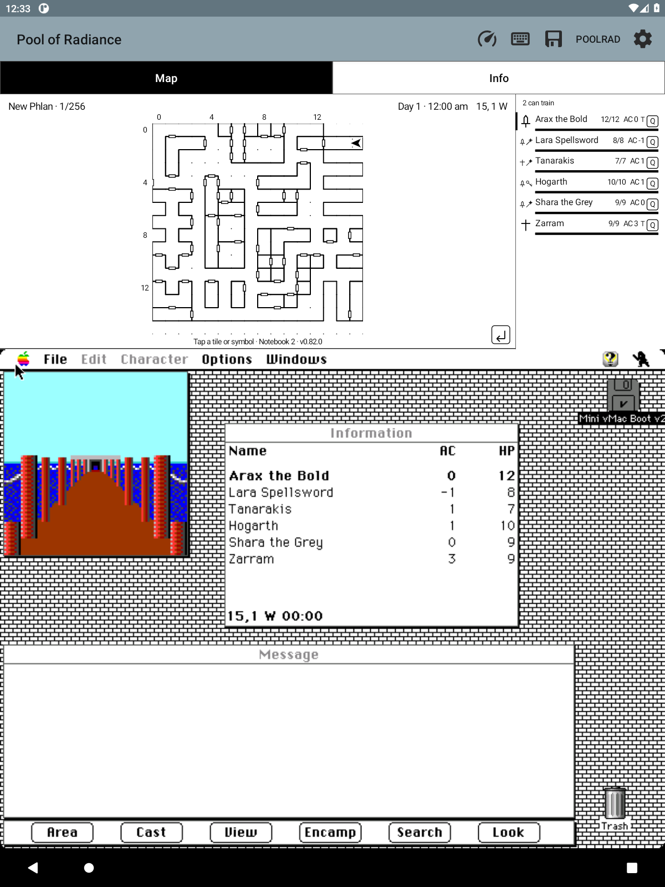

# PoolRad Mac Maps

**Your Macintosh Pool of Radiance adventure, with a live map above it.**

A small Android Mini vMac fork built for playing on an e-ink tablet. The
original game runs unchanged; a monochrome map follows your party directly
from emulated memory. No root, cloud, or separate companion window.

**Inspired by [Gold Box Companion](https://gbc.zorbus.net/), the PC/DOSBox
companion for Pool of Radiance.** Its automapping and convenience features
sparked this project; this is an independent Macintosh/Android implementation,
not a port of its code or an official game release.

*Captured from the running app. Every README screenshot is checked at release time and refreshed within three releases. Game artwork belongs to its respective owners.*

## The map draws itself

Walls, doors, coordinates and your facing arrow, read live from the game's own
memory across 29 named areas — no guessed names. Camp, combat and loading
states are labelled, so a reference map never lies about what it is showing. The
header also shows the **game’s own day and am/pm time**, advancing with the
game rather than your tablet’s clock.

**Fog of war** hides everything you have not walked, so the map fills in the way
you drew it. **Info → Options** turns it on and off, and both it and the
footprints are remembered **per area** — clearing the fog in the slums does not
clear it in the caves. The same page controls compact party rows, larger
messages and automatic snapshots.

**Directional footprints** record the way you actually walked, so a corridor you
have been down twice looks different from one you passed once. Doors you have
stood beside and never gone through are marked, which is your own map telling
you where you have not been.

## Your party, at a glance

Names, HP bars, armor class and class symbols sit beside the map. Tap anyone
for spell readiness per level, readied weapon and armor, carried weight, and
the game's own next-level figures. The tap also selects that character in the
original game's Information window, following the window if you move it.
A quiet badge flags injury, poison, dying or
petrification, with the exact wording on tap. **Q** turns quick combat on for
one character, queuing your choice if the game is temporarily busy; **T**
appears where the game itself will let them train.

Hold a party row to open that character’s **original game sheet**. NPCs have
an explicit **NPC** prefix, and **Info → Marching order** lists everyone from
first to last.

**Info → Money** shows every character’s purse and the whole party’s coin
totals, with an exact gold equivalent. Gems and jewelry stay separate as
counts. The same page opens the manual coin converter.

## When a fight starts

A read-only overview shows every combatant's square — yours filled, everyone
else hollow. **The ring says whose turn it is**, and the same character's row is
marked beside it, so "who is the game waiting for" has an answer without
counting figures. Tap any of your squares and that row lights up for a few
seconds. The header names the monsters and counts those still standing. The
overview clears when the battle ends.

Anyone down is drawn as a cross rather than dropped: a diagonal one for someone
still worth reaching, an upright one for past helping.

## Write on the map

Tap any tile for a handwritten page: the map on the left, your writing on the
right. Pen, ink-only eraser, undo/redo, autosave, nine map symbols, and finger
zoom/pan. Separate notebooks keep campaigns apart, and a single backup carries
your handwriting, flags, walked tiles and journal history.

## The whole journal, built in

All 58 journal entries, 18 proclamations, 23 tavern tales and the 14 original
illustrations ship with the app — nothing to import, nothing to look up online.
References the game cites out loud collect themselves into an encountered list,
tappable straight into the reader. New citations have a **Read** notice that
opens the exact entry. **Info → Message log** keeps the latest 200 observed
game messages in the current notebook.

## Ten quick saves, with pictures

**PoolRad → Quick save** keeps your ten latest snapshots. **Quick load** restores
the newest quick save immediately. **Load…** shows all quick, named and automatic
saves with their date, time and captured game screen; choose one to preview and load.
The small previews are encoded in the background, and each snapshot remembers
its notebook. Snapshots now require disk verification: older emulator snapshots
are unsupported. A missing picture does not block a valid new snapshot.

**Resume on launch:** the app tries your last completed quick, named or automatic
snapshot. It resumes when the mounted disks match and the paired notebook still
exists. **Start normally** skips the attempt; **Info → Options** can turn it off.
If a snapshot cannot be used, the Mac boots normally.

Original-game save-file backups live under **Settings → Back up / restore game
saves…**. These are separate from emulator snapshots and notebook exports.
Snapshots restore memory, **not disk contents**; keep independent disk backups
and use the Mac's normal shutdown instead of force-quitting. Loading requires
the mounted disks to match the snapshot exactly; a mismatch leaves the running
game intact. This prevents stale memory from being restored against newer disks.
Hard quits can still damage HFS metadata. [Save-state details](docs/SAVE_STATES.md).

## Also offline

Everything the game expects you to look up on paper, in the app: spells, weapons
and armor, class progression, mixed-coin conversion, companion options, and
automatic code-wheel entry with an illustrated fallback.

Save or share a PNG of the map, game and keyboard together · install alongside
your existing Mini vMac setup.

**Early prototype.** Verified against Macintosh Pool of Radiance v1.1 in New
Phlan and the adjoining Slums gate round trip; broader transition coverage,
the combat arena’s true bounds, wilderness maps and newly recruited live NPC
acceptance remain unfinished. Testing
happens on a real e-ink tablet, where stylus drawing and two-finger zoom/scroll
work well as of 2026-09-15; rotation and keyboard layout are still unreported.

[Exploration trail](docs/EXPLORATION.md) · [Handwritten notes](docs/NOTEBOOK.md) · [Flag pages & symbols](docs/MAP_INK.md)

## Install

This is an **Android app, not a browser game**. The
[0.85.0 prototype APK](https://github.com/huntergdavis/poolrad-macmaps/releases/tag/v0.85.0)
supports Android 5.0+ and includes the Mac II emulator.

1. [Download the APK](https://github.com/huntergdavis/poolrad-macmaps/releases/download/v0.85.0/poolrad-macmaps-0.85.0.apk) on your tablet.
2. Tap the APK and allow installation from your file manager when prompted.
3. Open **Pool of Radiance** and select your own matching Mac ROM.
4. Import copies of your boot/game disks, launch the game, and load your party.

**Bring your own ROM, Mac system disk, and Macintosh game.** None are in the
public APK. [Step-by-step setup and troubleshooting →](docs/INSTALL.md)

Updates install over the existing app, but
[export a notebook backup](docs/NOTEBOOK_BACKUPS.md) before uninstalling or
clearing app data. Optionally and privately, you can
[combine System 7 and your game disks into one auto-booting disk](docs/PERSONAL_BOOT.md)
and [bundle them into your own ready-to-play APK](docs/PERSONAL_PACKAGE.md);
the public download stays bring-your-own-files.

## Project

[Backlog](docs/BACKLOG.md) · [Build/test details](docs/LOCAL_TESTING.md) ·
[Research](docs/RESEARCH.md) · [Design ethos](docs/DESIGN.md) · [Companion tabs](docs/TABS.md)

Built on [Mini vMac for Android](android/UPSTREAM.md) (GPLv2), with DAX/GEO
format work credited to [Gold Box Explorer](licenses/GoldBoxExplorer-MIT.txt)
(MIT). Code-wheel reference: [Dave Kennedy / Andrew Schultz](https://dkennedy.io/por-code-wheel/wwm.html).
All 72 rune pictures are [bundled and credited](licenses/CODE_WHEEL_ARTWORK.md);
no artwork downloads are needed to build or use the app.

[Companion options](docs/OPTIONS.md) · [Message log](docs/MESSAGE_LOG.md) ·
[Marching order](docs/MARCHING_ORDER.md) · [NPC labels](docs/NPC_MARKER.md)

The original Macintosh v1.1 game-save format is documented in
[the public specification](docs/SAVE_FORMAT.md), with exact two-fork framing
and the verified character, inventory and effect layout. The
[host writer](docs/SAVE_WRITER.md) generates a new save from a private capture;
cross-platform conversion remains separate unfinished work.
