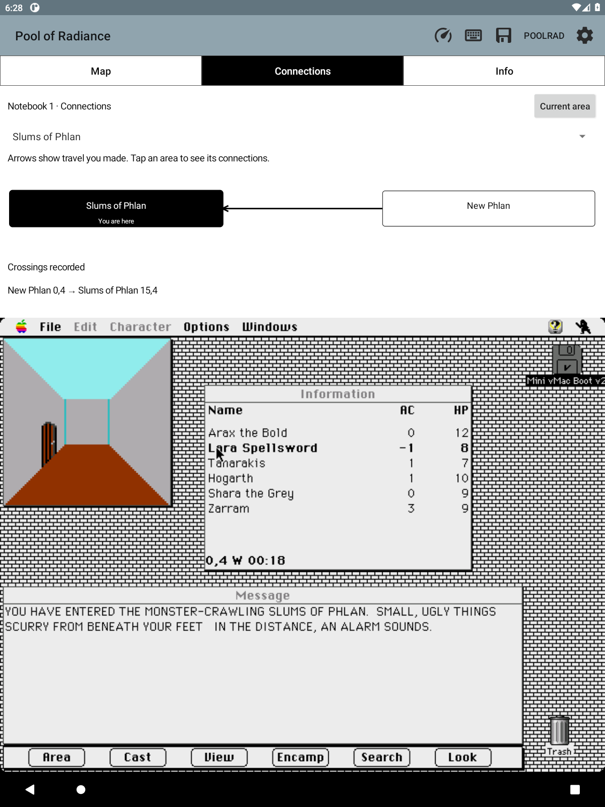

# Discovered area connections — F58

**Connections**, beside **Map**, shows passages this party actually traveled.
The view starts empty. It records doors, stairs, teleports and scripted travel
between identified local areas; it does not reveal destinations from game data.
An arrow appears only in a direction actually traveled. Walking back adds the
return direction. Separate passages between the same areas keep separate
source/arrival-square entries; repeating a trip does not duplicate an entry.

Tap a neighboring area to inspect its connections, choose a discovered area
from the list, or use **Current area** to follow the party again. The graph is
schematic: box placement does not claim geographic distance or direction.
The crossing list preserves coordinates from the observations. **Map** returns
to the usual local map; game input and notebook auto-follow still work.

History belongs to the selected campaign notebook and survives restarts and
loading older game saves. Loading a save creates no discoveries. Notebook
exports include the atomic, checksummed connections.bin file. Old notebooks
start empty; older app versions reject backups containing this unfamiliar file
rather than silently losing connections. Corruption is reported and preserved.

## Evidence contract

PRM7 appends a separate travel epoch, native GEO-change count and last settled
departure square. The original footprint epoch and its stricter relocation
rules are unchanged. Travel permits script relocation but retains the original
verified loading flags, active-game profile, local engine and menu guards from
[MAP_MEMORY.md](MAP_MEMORY.md#prm3-settled-exploration-not-combat-coordinates).
Full-machine snapshot restoration explicitly resets both host trackers.
No guest RAM, game disk or save is changed by connection tracking.

Both endpoints must independently pass the existing area fingerprint check.
Java requires the same travel epoch, exactly one native area change, a matching
source ID, and continuous polling with gaps no longer than 1.25 seconds. Busy
local frames can bridge an area load; they cannot supply an endpoint. The
native tick observer counts intermediate GEO changes even between Java reads.
Unknown areas, wilderness, camp/combat, backgrounding, invalid samples and
missed transitions cannot invent a shortcut. This is sampled observation, not
instruction-by-instruction replay, and it cannot reconstruct old travel.

The departure is the last settled native square before the area changed; the
arrival is the first authenticated settled destination observed by Android.
No path is interpolated, and no reciprocal direction is assumed.

## Validation

The 0.88.0 universal APK passes all 702 Java tests. New coverage checks directed
recording, exact departure/arrival squares, duplicate suppression, interrupted
polling, missed native transitions, reload epochs, malformed metadata, campaign
isolation, corruption preservation and backup round trips. The native map suite
passes with address/undefined-behavior sanitizers, including loading guards,
serial overflow and explicit snapshot reset. The production snapshot traversal
suite also passes. APK architecture, bundled-content and signature checks pass.

On the owned API 30 emulator, the visible Connections acceptance run passes
empty history, one-way discovery, actual touch navigation, current-area return,
observed reverse travel, duplicate suppression, simulated reload rejection,
missed-area rejection and durable history. Ten companion-pane checks pass,
including retained tabs, input focus, large text, landscape and unchanged guest
bounds. Controlled packet tests use authenticated synthetic fixtures; real game
crossing evidence is recorded separately below.

Local automated evidence: scratch/f58-ui-accepted.log,
scratch/connections-check.JvMB0X, scratch/f58-companion-final.log,
scratch/f58-final-build.log and scratch/f58-snapshot-native.log. The generic fast
verifier's two snapshot compile attempts lack the model include path; the
separate production snapshot script supplies it and passes. Optional Python
checks requiring machfs/macresources were skipped. Physical e-ink hardware was
not tested.

### Real game traversal

The owned API 30 emulator ran the final 0.88.0 APK with a disposable copy of the
known game disk/snapshot fixture. Ordinary game keys followed the existing F57
New Phlan route from 15,1 to the gate at 0,4, then entered the Slums at 15,4.
Connections was open while walking. No connection existed before crossing;
after the destination settled, the graph showed exactly one incoming arrow
and the correct departure/arrival squares. The campaign file independently
passed its CRC and contained exactly that one directed record. Notebook
auto-follow also opened the Slums arrival page.

The app's normal **Info → Saves → Load** then restored LaunchComplete from the
Slums to New Phlan 15,1. The core reported a successful restore, the live game
and notebook showed New Phlan, and connections.bin stayed byte-for-byte
identical: no reverse arrow and no invented connection to the restored square.
Evidence: scratch/f58-live-one-way.png, scratch/f58-live-one-way.bin,
scratch/f58-reloaded-settled.png and scratch/f58-after-reload.bin.

Loading the existing Slums autosave also left the same single record unchanged.
The party then turned east and physically crossed back into New Phlan. Only
then did the reverse arrow appear. The CRC-validated file contained exactly
New Phlan 0,4 → Slums 15,4 and Slums 15,4 → New Phlan 0,4. Evidence:
scratch/f58-live-two-way.png and scratch/f58-live-two-way.bin.

The route reuses the live F57 gate check. The original loader/area guard research
in MAP_MEMORY.md was also corroborated by recalled agent session
1d01c279-196; no undiscovered game-data links are used. Actual stairs and
teleports were not individually traversed in this acceptance run; their
recording policy is exercised through native relocation and Java transition
fixtures.
