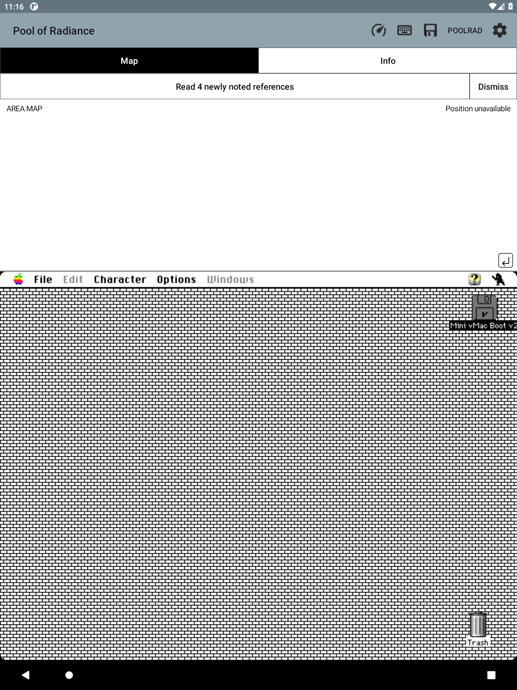

# Open a newly cited reference

When the existing Message-window reader recognizes a journal reference for the
first time in this notebook, a retained notice appears below the companion tabs.
**Read Tavern tale 15**, for example, opens that exact entry. A message naming
several new references opens a short chooser containing only those references.
**Dismiss** clears the notice without opening a page.

The notice stays within the companion's allocation above the original game,
uses monochrome buttons, and takes no keyboard focus. It remains available
when switching Map/Info; a hidden companion shows it when next revealed.
Switching notebooks or beginning a snapshot load clears it. An asynchronous
journal read refuses to open an old campaign's citation after a notebook switch.
A later new citation replaces the current notice. Already encountered references
remain in the journal list and do not produce repeated notices.

This uses the existing conservative citation parser: it recognizes verified
game wording, not arbitrary numbers or inferred references. Prior research is
recorded in MESSAGE_MEMORY.md and recalled Deja session
1d01c279-196b-4165-83cb-2031016bb071. No journal recognition rule changed here.

## Verification

The Android build and 646 Java tests passed. All nine Android companion checks
passed, including notice bounds at short heights, accessibility, no focus
capture, one-shot open, dismissal, and clearing a stale action.

On disposable emulator-5586, host-only PRT1 fixtures were replayed into a separate
Notebook 3 through the normal notebook message callback. The single-reference
notice opened Tavern tale 15 directly. The multi-reference notice offered
Proclamations 64, 78, 109 and 59; choosing 78 opened that exact entry.
Switching to Notebook 2 cleared a pending Tavern tale 7 notice.
These exercise the UI with previously verified message wording; they are not
claimed as newly encountered game events. No guest RAM was modified.

The reusable emulator-only debugger launcher supports GuestCommand, CoreStatus
and ReplayMessage. ReplayMessage requires the expected active notebook label
and a validated bounded packet before invoking the host callback.

