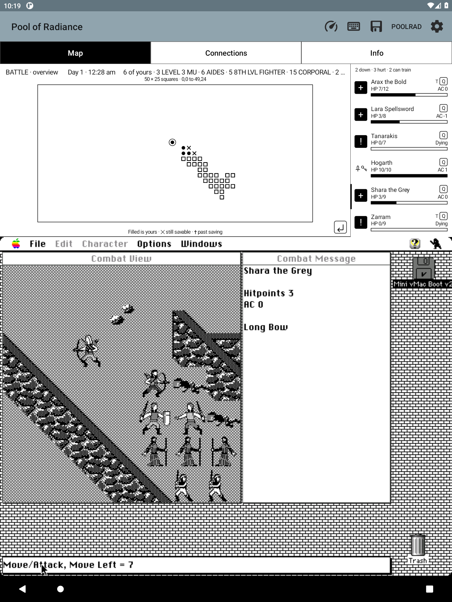

# The tactical combat state in memory — research notes

**Status: L2 shipped in 0.25.0 from these findings.** This records how the
original game's tactical combat is read, what was ruled out on the way, and
what is still undecoded.

For the current view controls, see [map and combat zoom](MAP_ZOOM.md).
Since 0.107.0, fights open framed around the combatants; **Fit** shows the
whole arena. The fixed arena dimensions researched below still apply.

## The table, verified

    A5-0x46e8            count, zero whenever no battle is running
    A5-0x46e4 + i*4      { i, flag, x, y } for i in 0..count-1
    A5-0x46e4 + count*4  a sentinel entry whose x and y are both zero

Entry `i` is the `i`-th combatant of the roster chain, so the party members
come first and the party/other split needs no new field. Each entry states its
own index, which makes the table self-checking: the reader refuses it if any
entry disagrees, if the sentinel is missing, or if the count disagrees with the
chain length. Confirmed on two live battles (sixteen combatants and
thirty-five) and on camp, walking and an area arrival, where the count is zero.

**The input question is answered: in combat the party moves with the numeric
keypad**, the mirror of exploration, where it moves with the number keys. The
`Move Left` counter confirms each step, which is what finally made a clean
one-square before/after diff possible.

*Corrected 2026-09-17.* This said "arrow keys" and that was wrong. Hunter: "the
numeric keys 1-9 on a keyboard are better, because of the diagonals! ... 1 and 3
are upper left and upper right respectively." The diagonals are the whole point
and no arrow can do them. Checked against the build: Android's four arrow
keycodes map to `-1` in `keycodeTranslationTable`, so an arrow key has never
reached the guest at all, and pressing one in combat moves nobody — which is
exactly what happened when this note was taken at face value. The keypad
keycodes, 144 upward, were past the end of that table, so a hardware keypad did
not reach the guest either; only the app's own on-screen numpad did, which is
why this went unnoticed. The table now runs to 161 and maps the keypad to the
same Mac codes `us_numpad.xml` sends.

## Verified: the combatant list is already reachable

The party reader already walks the combat roster, because in this game it is
the same linked list as the party with the monsters appended. From
`A5 - 0x519e` (`POOLRAD_PARTY_HEAD_BACK`) through each record's next handle at
`+0x110`, with slot `0..7` for party members and `8` for monster groups. See
[PARTY.md](PARTY.md) and `POOLRAD_PARTY.h`; nothing new is needed for the
roster itself.

A live capture of one battle walked cleanly: six party members followed by ten
`ORC` records, all validated by the existing heap-block and slot guards.

## Ruled out: the records do not carry tactical positions

The ten orc records in that capture are **byte-for-byte identical except at
four offsets**:

| Offset | What it is |
| --- | --- |
| `+0x110..+0x113` | the next handle in the chain |
| `+0x114..+0x117` | a distinct handle per combatant, four bytes apart, all inside one small master-pointer block — the combatant's own handle |

There is no per-orc coordinate anywhere in the 302-byte record: ten monsters
standing on ten different squares share every other byte. So the tactical grid
and the combatants' places on it live in a **separate structure**, and L2 needs
that structure, not another record field.

## The method for controlled captures

The cheap, repeatable battle is the **council guard**, not a tavern brawl:

- Walk into the City Hall (door at 3,4 facing east), south to 4,5, east to 5,5,
  then one more step east. The guard asks `DO YOU LEAVE?`; answering **No**
  starts a small fight immediately.
- A tavern tale is followed by `A DRUNKEN BRAWL BREAKS OUT`, which spawns waves
  faster than quick combat clears them and is a poor research subject. Two
  sessions were lost to it.

Route planning and the keyboard recipe are in [MESSAGE_MEMORY.md](MESSAGE_MEMORY.md).

## How the offsets were found

Two capture pairs, each around a single square of movement confirmed both on
screen and by the `Move Left` counter:

- one step **north** left a handful of bytes changed by exactly minus one;
- one step **east** left a different handful changed by exactly plus one.

Intersecting them — changed by a step on one axis, untouched by the step on the
other — left exactly one adjacent pair, `x` then `y`, inside the table above.
An earlier pair taken around a keypress that did **not** move anything was
discarded rather than interpreted; without a confirmed move a diff cannot be
told apart from the enemy's turn and the redraw.

## Open: is entry `i` still the `i`-th combatant once a fight is under way?

Hunter, 2026-09-15: "I don't think the enemy squares code is correct, I only saw
squares on my people who were on squares that used to be occupied by enemies."

The coordinates are read straight from the table and are not in doubt. What is
in doubt is the pairing above — entry `i` is the `i`-th combatant of the roster
chain — because the table carries no identity of its own: each entry states only
its own index. It was confirmed on two captures taken at the *start* of a
battle.

**First live re-check, 2026-09-16**, using the scripted driver
([GUEST_SCRIPTING.md](GUEST_SCRIPTING.md)) to reach a real 6-vs-10 fight and
compare the companion against the game's own Combat View: **at the start of a
battle the labelling is correct.** The game draws the party as six checkered
figures on the right — Arax the Bold was the selected one — and the ten enemies
as light shield-bearers on a diagonal up the left; the companion's six filled
circles and ten hollow squares sit exactly that way.

So the assumption holds when the table is built.

**Second live re-check, 2026-09-17: it also survives movement.** In a live
sixteen-combatant battle, with Hogarth acting, a single keypad step was taken
and RAM captured either side of it. Exactly one table entry changed —

    entry 3: (26,11) -> (25,12)      Hogarth is chain #3

— and nothing else in the table moved. Entry *i* was still combatant *i* after a
character had moved, so neither movement nor the turn order disturbs the
pairing. (The byte-level diff shows it at `A5-0x46d6`, which is the table base
plus `3 * 4 + 2`, confirming the arithmetic as well as the result.)

Two things were ruled out along the way. `flag`, the second byte of an entry, is
**not** the side: across a whole battle it read 0 for Arax and 1 for all fifteen
others and never changed as characters acted. And a first attempt that pressed
seven direction keys in a row proved nothing, because the entries did not move
at all — the presses were blocked, and the only thing that shifted was a
separate arena-relative copy of the same x values at `A5-0x45c1` (the shipped
table's x minus 24), which moved uniformly by +2 for all sixteen when the view
scrolled. One clean step is worth seven muddled ones.

**Answered, 2026-09-17, and this is the actual cause.** The dead are not
removed. In a live battle fought to several casualties, the chain was still 16
long and the table count still 16, with a killed orc sitting at combatant 7 and
holding its last square at (31,15) with 0 hit points. The game's own Combat View
stops drawing it; the overview did not. So a marker stayed where an enemy used
to be, and once the party advanced onto that square it read as a square sitting
on one of your own people — which is precisely what was reported.

The fix is to leave combatants at 0 hit points out of the packet, *after*
counting them for the index pairing: the pairing is by position in the chain and
must not shift because somebody was left out. Every other combatant keeps its
own square, which the tests assert directly.

Note what this also rules out: deaths do **not** disturb the ordering, because
nothing is removed from the chain. The two leads below were never needed.

**Formerly open: what happens when a combatant dies.** That is the one way the
chain and the table could fall out of step — a monster leaving the list would
shift every index after it — and it is the likeliest remaining explanation for
what Hunter saw. The reader refuses when the chain length and the table count
disagree, so the dangerous case is both changing while the *order* does not
match. Next experiment: kill one orc in the middle of the list and compare.

Two leads, neither of them acted on, if that experiment shows a break:

1. `flag` (entry `+1`, only ever 0 or 1, currently validated and ignored) may be
   the side itself, or alive, or "has acted".
2. Each record carries its own handle at `+0x114`, and in the captured battle
   those handles were four bytes apart inside one master-pointer block — so
   `(handle - block base) / 4` may be the combatant's true table index, pairing
   record to entry by identity rather than by order.

## Still undecoded

- **Terrain artwork/semantics.** F73 located the heap tile array described
  below. Decoding its tile graphics and deciding what terrain the overview
  should show remain separate work; the shipped overview draws no walls.
- **Arena bounds are now decoded:** see the F73 findings below. The earlier
  occupied-square framing was replaced in 0.98.0.
- **Initiative, facing, and which combatant is acting.**

## Scope reminder

L2 is a **distinct read-only view**. It must not automate combat, move anyone,
or reveal anything the player cannot already see on the game's own Combat View.
The companion already names Combat mode correctly and refuses to present the
retained exploration map as a tactical one; that behaviour stays.

## Full arena bounds (F73, 0.98.0)

The supported Macintosh game has a **fixed 50-column × 25-row combat arena**,
with inclusive coordinates **(0,0)–(49,24)**. These bounds come from the game's
own allocation, terrain addressing and coordinate validator, not the occupied
combatant rectangle or the older probe's conservative 0–63 sanity limit.

Read-only disassembly of the user-supplied game resource fork established:

| CODE resource / offset | Evidence |
| --- | --- |
| 9 / 28d4–28e0 | Allocates 0x4ea (1,258) bytes and stores the handle at A5−0x3ee0. |
| 9 / 12c6–142e | Visits x=0 through 49 and y=0 through 24, addressing terrain at handle data +7 + y×50 + x. |
| 9 / 15d0–1614 | Rejects tile writes outside x=0…49 and y=0…24. |
| 10 / 5712–5784 | The tile/occupancy lookup checks both axes against those same inclusive limits before indexing; outside returns zero. |
| 10 / 5180–521a | Computes viewport-relative combatant coordinates by subtracting arena data bytes +2 and +3; those bytes are the scrolling viewport origin, not arena bounds. |

The allocation fits seven header bytes, 1,250 tiles and one alignment byte.
Live RAM in the restored tavern fight corroborated it: A5=0x790aec, arena handle
0x68ef40, data 0x751cf8, heap header 0x820004f4 (physical 1,268 bytes, eight-byte
heap header, two-byte allocator correction: 1,258 logical bytes). The viewport
origin was (24,9). All 35 roster positions fit the full arena; the surviving
markers occupied only (25,11)–(35,20).

Reproduce the read-only code inspection with `tools/disassemble-game.py
RESOURCE_FORK 10 5712 5786` and `RESOURCE_FORK 9 28d4 291c`, using locally
installed `capstone` and `macresources`. Private game resources, RAM and disk
fixtures remain under ignored scratch storage.

The companion now keeps this entire rectangle fixed as characters move or
monsters disappear. Native and Java readers both reject coordinates outside
the actual arena. The PRC3 packet shape is unchanged: every accepted battle in
this supported game uses these same bounds, so no guessed per-fight dimensions
or new RAM field is needed. Terrain is not included in the overview.

Regression coverage includes both axis limits and all out-of-range byte
values, a single remaining combatant, movement, disappearance, stable empty
arena corners, marker tapping, and unchanged-update redraw suppression.

### Live verification

On emulator-5590, the installed 0.98.0 APK (versionCode 164) restored the
fingerprint-matched 35-combatant tavern fight through the normal snapshot path.
The full arena measured 730 × 365 screen pixels (50 × 25 at 14.6 pixels per
square), retaining empty space outside the occupied cluster. The bounds label
is on its own line below the battle header.

Normal combat input advanced the fight: enemy markers moved, Zarram changed
from standing to dying, Arax's HP changed from 12 to 7, and the turn ring moved
to Shara. A numeric-keypad northwest step moved Shara from (25,11) to (24,10);
the game reported Move Left = 7. A second read-only RAM capture confirmed the
same coordinate change and the unchanged arena allocation, while its viewport
origin changed from (24,9) to (22,8). The companion marker followed the step
without moving or resizing the arena border.

Validation: 735 Java unit tests, the ASan/UBSan native combat probe (including
every out-of-range coordinate byte on both axes), and all 20 detached Android
combat rendering checks passed. The rendering checks include fixed framing
after movement/disappearance, party marker taps, fallen shapes, narrow panes,
held readings and zero redraw requests for unchanged combat samples. The
render helper printed its complete 20-check success summary before Android's
app_process shutdown returned status 143; no check failed.
APK ABI/content, code-wheel assets and signing checks passed.
