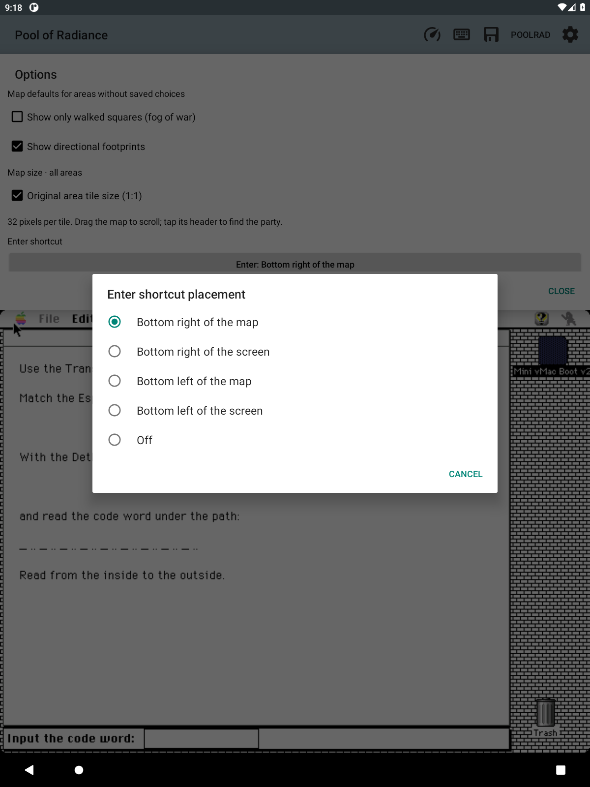

# Enter shortcut placement

Tap **⏎** to press Return without opening the keyboard.

Since 0.110.0, **Info → Options → Enter shortcut** lets you choose:

- Bottom right of the map (default).
- Bottom right of the screen.
- Bottom left of the map.
- Bottom left of the screen.
- Off.

The choice takes effect immediately and is remembered across app restarts.

- **Map corners:** the button appears on the map and combat overview. It hides
  when you change tabs or hide the map. Choosing the left corner moves the
  zoom controls aside.
- **Screen corners:** the button sits over the game and stays above an open
  keyboard. The trackpad's fullscreen button moves aside when needed.
- **Off:** removes the button.

*Development-build capture for 0.110.0, taken before the version bump from
0.109.0. The default is the map's lower-right corner.*

## Implementation

Both routes call `EmulatorFragment.pressGuestReturn`: the same translated Return
scancode down/up used by the established map shortcut. No guest memory writes,
new game commands, timers, or polling are introduced. Hardware key focus stays
on the guest. Accessibility exposes an Enter action on the map and an Enter
button on the screen overlay.

The placement values live in `EnterPlacement`, under `pref_enter_placement`.
Absent or unknown values use the map-right default. `LiveMapView` owns map
placement; `EnterOverlayButton` is a child of `guest_frame` in `screen.xml`.

## Verification

`tools/render-check.sh EnterPlacementRenderCheck` exercises Android touch
dispatch: both map corners, separate zoom targets, cancelled gestures, removed
targets, overlay click callbacks, no guest mouse leak, outside taps, and Off.
The detached view fixture explicitly delivers Android's queued click callback.
`MapZoomRenderCheck` covers exploration zoom/pan/note alignment and combat camera
behavior. Both pass, along with all 735 Java tests.

Live verification on emulator-5590, 2026-09-20: selected every visible placement
through Options. From each of the four corners, Enter dismissed the original
game's **About Pool of Radiance** dialog. The loaded RestRefresh party remained
at Slums 2,11 S, Day 1 12:47 am. Map-left visibly kept Enter separate from the
shifted zoom controls, and screen placements removed the map copy.
Off removed the shortcut from both the map and guest screen; the saved
`pref_enter_placement` value was independently read back as `off`.

Before/after screenshots and recordings are retained locally as
`scratch/enter-map-right-*`, `scratch/enter-screen-right-dialog.png`,
`scratch/enter-screen-right-verified.png`, `scratch/enter-map-left-*`,
`scratch/enter-screen-left-*`, `scratch/enter-placements.mp4` and
`scratch/enter-left-off.mp4`, plus `scratch/enter-off-placed.png`. The first screen-right menu gesture was too fast
to open About; the recorded verified retry used a held menu press before Enter.
