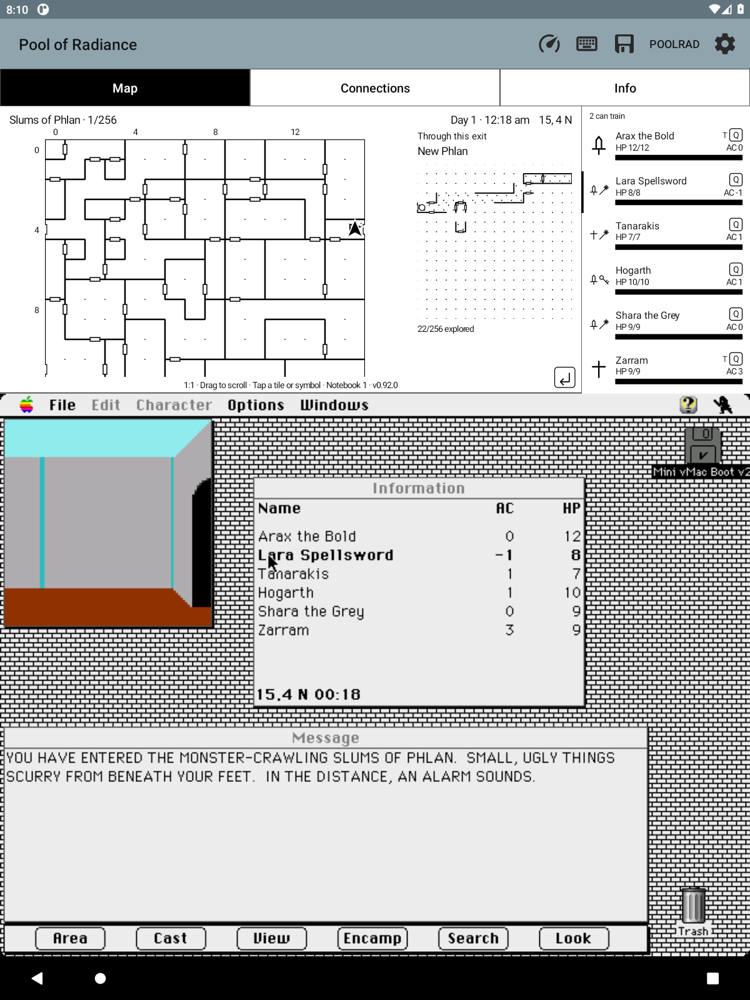

# Original area tile size

Info → Options → **Original area tile size (1:1)** sets the companion area
map to 32 physical display pixels per square. The map’s **−/+** controls can
zoom from this scale; **1:1** resets it. It is off by default and saved
globally. Drag to see the rest of a map that does not fit. Tapping its header
brings the party back into view. Actual movement keeps the party visible;
unchanged readings leave a manually scrolled view alone.

The game's Area window has a 32-pixel tile pitch. On the 1200-pixel-wide test
emulator, the original 640-pixel Macintosh display is enlarged 1.875×; successive
grid lines in the Area window are 60 display pixels apart (60 / 1.875 = 32).
The companion uses 32 pixels directly, without Android density scaling or the
guest display's enlargement. This preserves the companion's own artwork,
notes, flags, exploration history and fog choices. Known-exit previews,
Connections, the legend and party information keep their existing layouts.
[Map zoom](MAP_ZOOM.md) also provides independent combat framing and controls.

The same viewport supplies drawing and note coordinates. Scroll bounds keep
all 16×16 tiles reachable, and clipping prevents maps or note taps from spilling
into headers, captions or adjacent panels. A drag cannot become a note tap,
including when it returns to its starting point. There is no animation or
inertial scrolling.

Implementation reuses the shared map transform and touch-cancellation pattern
in MapViewport and LiveMapView. The prior-session search was
`deja "original map scale"`; it supplied no authoritative tile size, so the
measurement above came from the running game.

Validation on the owned API 30 emulator (1200×1600, density 1.25):
the option began unchecked, enabling it changed the live map to 32-pixel
squares, and dragging exposed the lower rows without opening a note or moving
the party. The scrolled New Phlan 0,4 flag reopened its existing note. The
header brought the party back into view. Crossing from Slums to New Phlan
retained the scale and both discovered directions. The automatic note-opening
behavior present in this older test was removed in 0.104.0. Exit previews retained their independently explored
coverage (22 squares in New Phlan and one in Slums).

All 725 Java tests pass, including density-independent tile sizing, scroll
limits and clipped hit targets. Six detached Android View/Canvas checks cover
exact restoration of fitted pixels, two-axis dragging, fixed header/caption,
scrolled note targets, cancellation, movement versus stationary updates,
find-party and scrolling a retained camp map without enabling note taps.
APK ABI, bundled-content, signature and README screenshot checks pass.

The saved choice also survived an in-place update and a cold app start; the
final 0.92.0 APK restored into the 32-pixel map with its existing flag and
known-exit preview intact.

