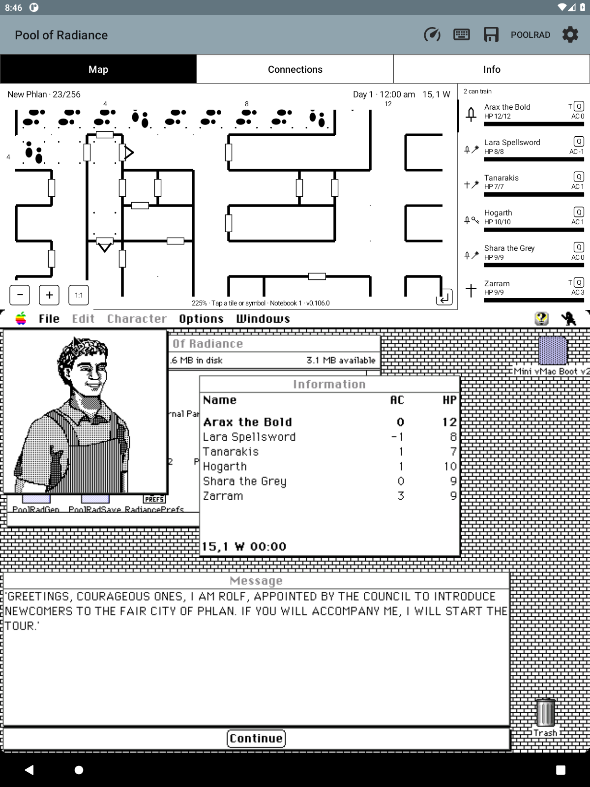
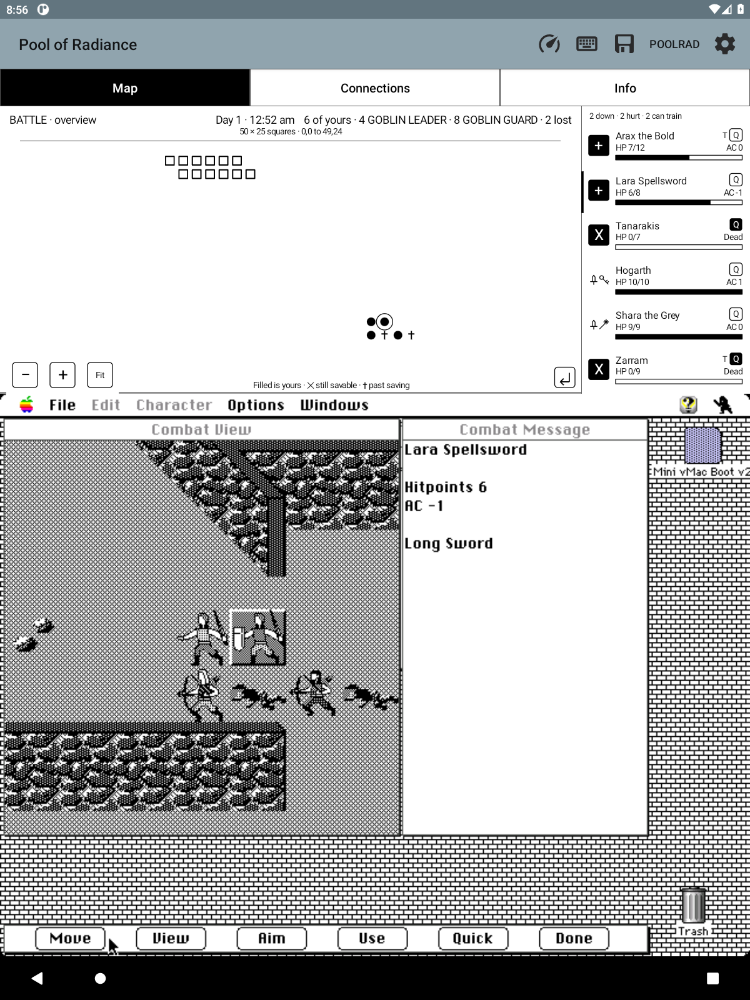

# Map zoom

Use **−** and **+** at the lower left of the map to see more of the area or
enlarge details. Drag the enlarged map to look around. Notes, flags, footprints,
fog, and the party marker stay aligned as you zoom.

Exploration starts at the existing selected scale. **Fit** restores the fitted
map; with **Original area tile size (1:1)** enabled, the reset button reads
**1:1** and restores 32 physical pixels per tile. Tapping the area header
brings the party into view. Zoom changes apply to the current view.

A new fight starts framed around all known combatants, with two squares of
margin and a bounded maximum enlargement. This includes fallen party members.
The arena is still the game's full **50×25 squares**; no terrain is inferred.
Use **Fit** to see the entire arena, or tap the battle header to frame the
current action again. Combat updates preserve manual zoom and pan. Leaving
combat restores the exploration view; the next fight starts freshly framed.

*Development-build capture for 0.107.0, still labeled 0.106.0. New Phlan is
enlarged to 225%.*

*From the same test build. Tapping the battle header brought all fighters
back into view without changing Lara's turn.*

Buttons have 48dp touch targets and named accessibility actions. Zoom and pan
do not send game input or open notebook pages. Rendering stays event-driven;
unchanged combat readings do not request a redraw.

Implementation reuses the shared transform and gesture cancellation documented
in [MAP_SCALE.md](MAP_SCALE.md), and the verified arena bounds from
[COMBAT_MEMORY.md](COMBAT_MEMORY.md). The required prior-session search
(`deja "map zoom combat occupied bounds true scale"`) returned no matches.

## Verification

All 734 Java tests passed, including clipping and note-coordinate checks at
zoomed scales and combat framing at arena edges. Detached Android checks passed:
the new zoom/gesture checks, 20 existing combat checks (including zero redraws
for unchanged samples), and six original-scale checks.

Live on the owned 1200×1600 emulator at normal speed, New Phlan zoomed from
32-pixel tiles to 72-pixel tiles (225%), panned in both axes, zoomed out to 67%,
and reset to 1:1. The party stayed at 15,1 west, and neither zoom nor dragging
opened a note. A 30-second recording is retained locally as
`scratch/map-zoom-exploration.mp4`; the before/detail/pan/wide/reset screenshots
use the `scratch/map-zoom-live-` prefix.

The real Slums fight at 2,6 north (00:52) opened automatically at **147%**
with all six party markers and twelve enemies (four Goblin Leaders and eight
Goblin Guards) in view. **Fit** showed the whole 50×25 arena; plus and dragging
enlarged and moved the view, and the header framed all combatants again.
Lara remained the acting character throughout these view-only interactions.
The combat entry recording is `scratch/map-zoom-combat.mp4`; entry, Fit, detail
and refocus screenshots are retained alongside it.

At the owner's request, **Quick save** captured the live fight successfully
at 08:56 PDT on emulator-5590. Its app-private relative path is
`savestates/quick-history/q00000000000000000004_1789919776934.prqs`.
A local ignored copy and its notebook/rest/preview sidecars are in
`scratch/map-zoom-battle-checkpoint/`. Use **PoolRad → Quick load** on that
emulator to reopen it while it remains the newest quicksave.

Quick load was also exercised live: the restore log reported success and the
same Lara turn reopened directly in combat. No navigation back to the encounter
was needed. These local checkpoints include private game state and are excluded
from the public release.
