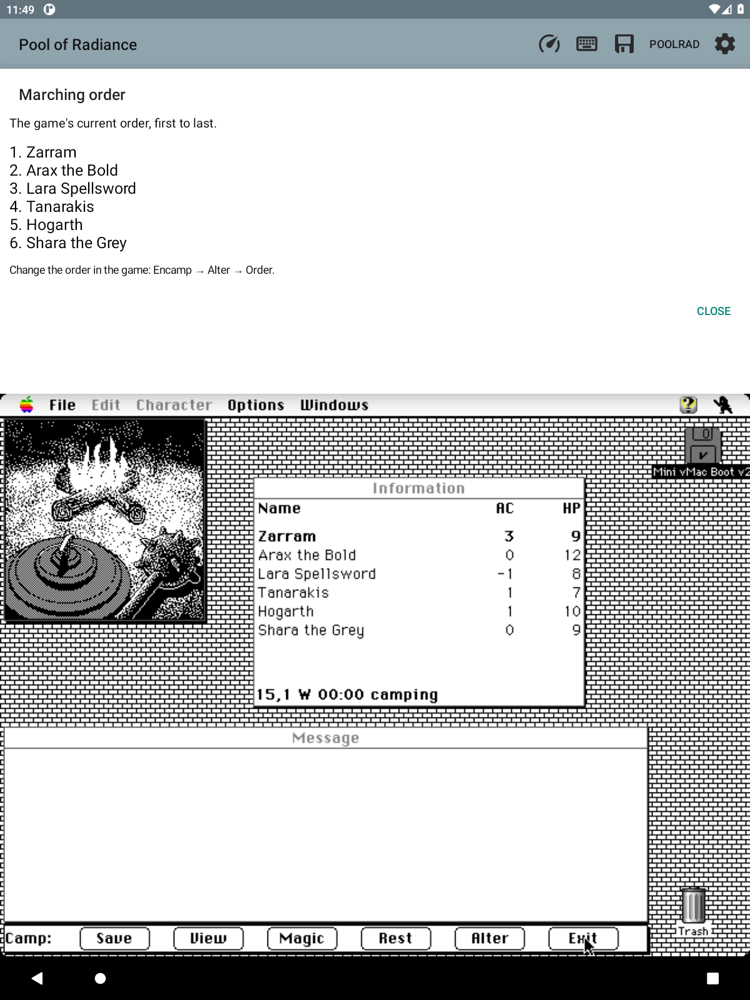

# Marching order

**Info → Marching order** shows the current validated party in numbered order,
first to last. This gives the order its own readable page, following the owner's
request to avoid adding more marks to already busy party rows.

The page follows the same immutable party readings and brief refusal hold as
the map. A changed order updates the text; unchanged readings cause no redraw.
When the map's party reading clears, the page says “Marching order unavailable.”
It scrolls within the companion allocation, requests no software keyboard, and stops
its refresh timer on pause or dismissal. There is no reorder action in this
page. Close it to use the original controls: **Encamp → Alter → Order**.

The source is the existing validated roster chain, not the selected-character
pointer or numeric party slots. The game's real Order operation was verified
to change this chain and the displayed rows together; see PARTY.md, “Live
damage and reorder (2026-09-14).” Deja session
1d01c279-196b-4165-83cb-2031016bb071 was recalled for the prior order-work lead.
This feature adds no new RAM offsets and writes no guest data.

## Reusable acceptance workflow

Repeated normal shutdown, APK update and original-game reload are now combined:

    python3 tools/update-test-app.py emulator-5586 \
      android/minivmac/build/outputs/apk/macII/debug/minivmac-macII-universal-debug.apk \
      ExportProof scratch/new-update-evidence

The script requires a disposable emulator, an existing universal APK, a named
save, and a new evidence directory. It checks the APK's ABIs, records its SHA-256,
uses the normal guest shutdown helper, verifies disk descriptors closed before
installation, starts the app and runs the guarded save loader. Screenshots and
OCR evidence are retained. Unexpected screens stop the workflow; there is no
force-stop, reset, guest-memory patch, or stale snapshot restore.

## Acceptance — 2026-09-19

The universal build and all 647 Java tests passed. All nine Android companion
checks passed with the new tool routing, including short-height scrolling and
unchanged guest bounds.

The complete update-test-app workflow passed on disposable emulator-5586. After
the original game loaded ExportProof, the page showed all six members in the
same order as Information. The game then moved Zarram from last to first through
Encamp → Alter → Order, Select, digit 1, Place. Reopening the page showed
Zarram, Arax, Lara, Tanarakis, Hogarth and Shara in that exact order.
No physical-tablet acceptance is claimed.

