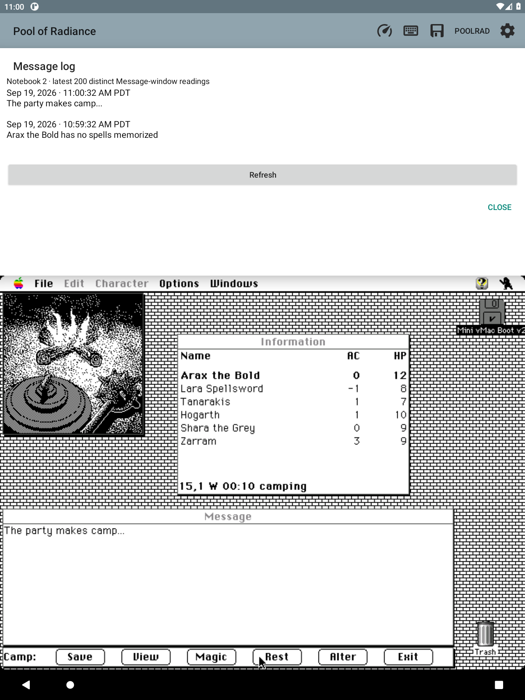

# Message log

F47 adds **Info → Message log**, showing the newest observed Message-window
readings first. Each notebook keeps its own latest 200 readings. Times are the
device's wall-clock observation time, shown with am/pm and timezone; they are
not the game's day/time.

Repeated polls of unchanged text add nothing. A growing text buffer updates its
last reading rather than adding every partial version. A visible empty window
separates a later repeat of the same text. Unavailable samples add nothing.
Each reading is at most the existing reader's 512 characters; truncated readings
are marked. This is a history of what the companion observed, not a guarantee
that it captured text replaced between polls or the separate Combat Message
window. Recording continues on the Info tab or with the companion hidden and
pauses while the app is backgrounded.

The page stays above the guest, scrolls, and has Refresh. The log survives app
recreation and follows the active notebook. Loading a state pauses recording
until its campaign transition completes; the notebook's history is retained
rather than rolled backward with guest RAM.

A short debounce combines disk writes while text grows. Pending updates flush
before notebook switches, snapshot transitions, exports, removals, and controller
disposal, using the notebook's existing ordered worker. Files are atomically
published in the app-private notebook store as checksummed, identity-bound
messages.bin records. Damaged/foreign data is refused and kept rather than
silently replaced.

Notebook and whole-companion backups include message history. Older backups
without it import as an empty log. Older app versions that do not recognize
messages.bin cannot import a newer backup containing it; the current importer
validates it before publishing any restored notebook.

Eight new unit tests cover repeated/unavailable samples, growing text, cleared
windows, truncation, 200-entry rotation, serialization bounds, immutable views,
backup round trips, old backups, campaign isolation, deletion and damaged or
foreign records. The Android build and all 646 Java tests pass.

The reusable emulator-only loader is:

```sh
python3 tools/load-test-save.py emulator-5586 ExportProof scratch/new-load-evidence
```

Run it after booting the original game with no party loaded. It finds the normal
file picker and visible save by OCR, uses the existing timed guest-input path,
and retains screenshots for party/location verification. Unexpected screens
stop the script; it never resets the machine or patches game memory.


## Live acceptance — 2026-09-19

The test party was loaded through the original game. Its actual responses
“Arax the Bold has no spells memorized” and “The party makes camp...” appeared
newest-first in the log, with no duplicates after further polls and Refresh.
Independent inspection of the saved PRML file verified its notebook ID,
checksum, two-entry count and exact text. Notebook 1 did not inherit Notebook
2's earlier response. Switching back reloaded Notebook 2's original history.

All eight Android companion-navigation checks passed. The final build and all
646 Java tests passed. No physical-tablet retest is claimed.


