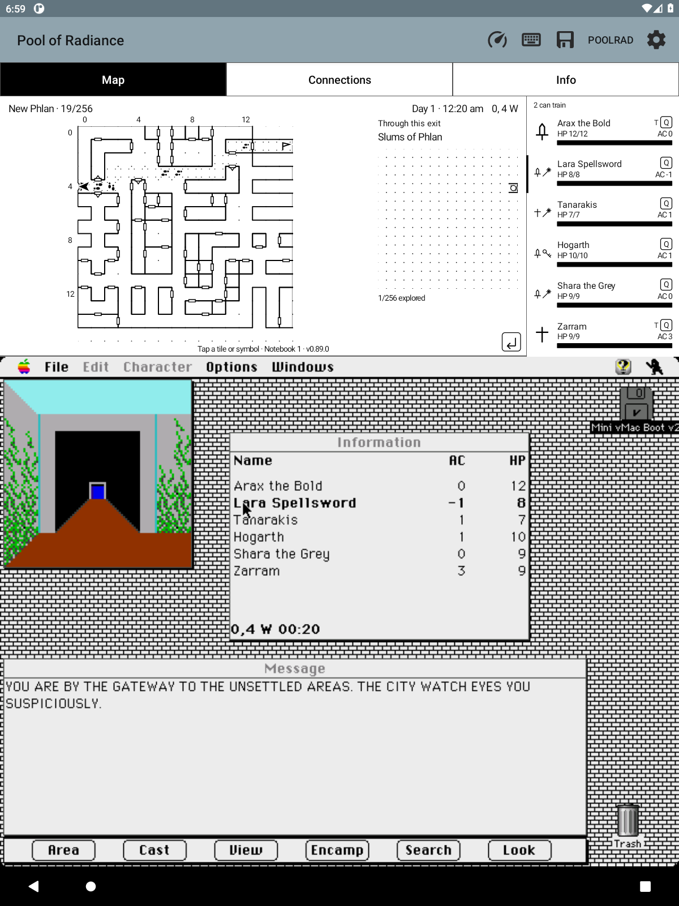

# Neighboring-area preview — F62

Stand on a previously traveled exit square to see a small destination map
beside the current map. Only an outgoing connection actually recorded by the
selected notebook qualifies. An incoming arrow alone does not imply a return
route. Ordinary squares, unknown areas and unavailable positions show no
preview. This is a peek before traveling, not a retained map of the last area.

The preview always shows only destination squares this notebook has explored,
even when the main map's full-map option is enabled. A ring marks the observed
arrival square if its geometry and exploration are remembered. If the same
square has multiple recorded destinations, tap the preview to cycle through
them; accessibility exposes the same action. Preview taps never open notes on
the current map. The game and party-list allocations stay unchanged.

Only neutral wall/door symbols for explored cells are remembered. Unexplored
cells contain zero geometry, and a hidden neighbor never supplies its own wall
or door. Coverage is checked again when loading a preview, so resetting an
area's walked map hides its remembered cells. No events, encounter tables,
whole GEO resources, or inferred links are stored. Loading a save can show an
already-known exit at the restored position but cannot discover one.

## Storage and older notebooks

Each area may have an atomic, checksummed explored-map.bin record, bound to
its notebook UUID and area ID. The fixed map body contains 32 visibility bytes
and 256 bytes of neutral edge symbols. All reads and writes use the notebook's
ordered background executor; unchanged cells do not cause disk writes.
Notebook export, import and removal include the record. Corrupt or unfamiliar
records are preserved and fail closed; no full-map fallback is shown.

Older notebooks retain their connections and walked coverage. Revisit an area
to remember its already-explored geometry for previews; until then its preview
says there is no remembered map. Backups with this new file require 0.89.0 or
later. This does not reconstruct exploration that was never recorded.

## Verification

The final 0.89.0 universal APK passes all 708 Java tests and 15 Android
software-Canvas checks. New tests cover explored-cell-only storage, invalid
hidden geometry, reset coverage, exact-square outgoing selection, multiple
destinations, restart reads, campaign isolation, backup round trips, corruption
preservation and note-list compatibility. A pixel comparison changes every
unexplored edge, including hidden-side doors, without changing the preview.

The visible API 30 emulator acceptance passes undiscovered exits, incoming-only
links, ordinary-square clearing, known-exit previews, explored-only coverage,
real touch isolation, cycling multiple destinations, and unavailable-position
clearing. Notebook auto-follow remains functional alongside the new files.
Evidence: scratch/f62-ui-final.log and
scratch/neighbor-preview-check.vya6h9/screenshots/f62-check.

The same emulator then ran the actual game using the existing F58 notebook and
its matching disposable disk/Slums snapshot. Its older explored coverage filled
in the new map record on revisit. Ordinary game keys crossed back to New Phlan,
stepped away to 1,4 (no preview), then returned to 0,4 facing west and stopped
before crossing. The live Map pane showed New Phlan beside a Slums preview with
exactly 1/256 explored squares and the arrival ring at 15,4. The party rows and
guest screen retained their space. The main map was in full-map mode while the
preview still hid all 255 unvisited cells.

The Slums record passed its CRC and contained geometry only for square 15,4;
all 255 unexplored cells were zero. The existing two directed connection
records stayed unchanged. Live evidence: scratch/f62-live-away.png,
scratch/f62-live-peek-settled.png, scratch/f62-real-slums-map.bin and
scratch/f62-live-connections.bin.

This reuses the observed connections and live gate fixture documented in
[AREA_CONNECTIONS.md](AREA_CONNECTIONS.md), plus the explored-cell visibility
rules in [EXPLORATION.md](EXPLORATION.md). The note-directory compatibility fix
uses the existing independent-area-record rule, also found in recalled session
1d01c279-196. APK architectures, bundled-content and signature checks pass;
README screenshot freshness also passes. Physical e-ink hardware and every
individual stairs/teleport passage were not tested.
