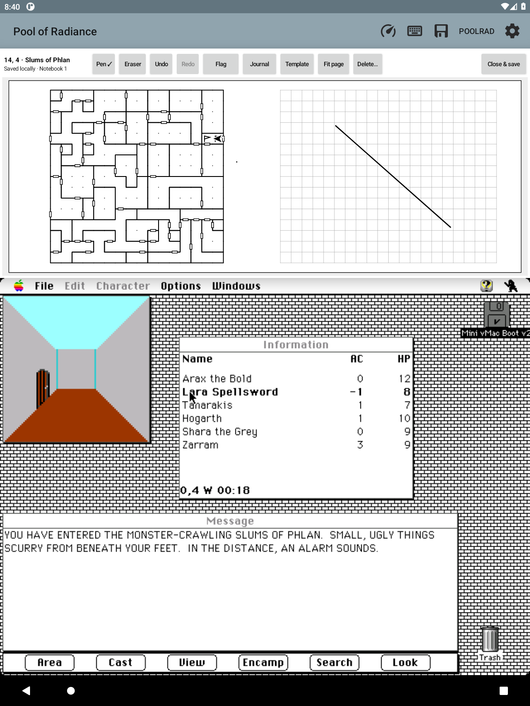

# Writing-half templates

Open a flag note and choose **Template** in its existing toolbar. **Blank
grid**, **Ruled list** and **Blank map frame** provide empty guides on the
writing half. The area map remains on the left. **Plain paper** is the
unchanged default, with no extra prompt when opening or creating a page.

Paper is separate from handwriting. Changing templates keeps existing ink;
Eraser and stroke Undo/Redo affect ink only. The choice autosaves per page
and is included in notebook backups, page images and PDFs. The chooser stays
above the guest and scrolls on short displays; the toolbar retains its
single row and fixed Close & save button.

The note model carries a stable template ID, saved in the checksummed PRNI
version-3 envelope. Version-1 and version-2 notes read as plain paper; merely
reading them changes no bytes. Legacy version-1 migration still retains its
original backup. Unknown template IDs are rejected without overwriting data.
The current editor and the existing image/PDF renderer draw the same paper
beneath the ink layer.

The prior-session search (`deja "notebook template"`) found no earlier
template design beyond backlog F76. The implementation reuses the existing
InkHistory, checksummed note envelope and shared InkSheetView export path.

Verified in the installed app on the owned API 30 emulator: a new
Slums 14,4 page began on plain paper without a prompt. Grid, ruled list and
map-frame choices each appeared beside the unchanged area map. A real
finger stroke remained while switching templates. Erasing restored the
original grid page with zero changed pixels; undo restored the stroke.
Closing and reopening the frame page restored its paper and handwriting
with zero changed pixels in the page body. After integrating the separate
autosave release, the final 0.94.0 build restored that frame and ink, switched
to grid paper, and saved/reopened with identical page pixels again.

All 736 Java tests pass, including old-note compatibility, blank template
pages, restart/backup round trips, independent stroke undo/redo and refusing
unknown template IDs without data loss. Eight actual Android export checks
and seven editor-layout checks pass, including unchanged map pixels,
eraser-safe guides, narrow scrolling controls and large text. APK content,
ABI, signature and README screenshot checks also pass.

