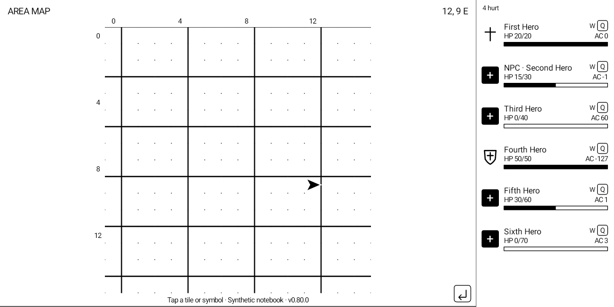
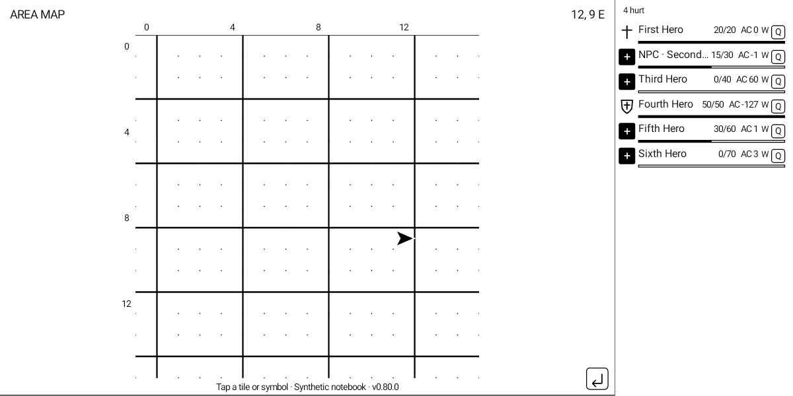

# Distinguishing NPC companions

F67 marks NPCs with **NPC ·** before their names in both party-row layouts,
character details, marching order, and named accessibility actions.
Putting the marker first keeps it visible when a long name is shortened.
The underlying character name remains unchanged for selection, Quick toggles
and combat matching.

## Original Macintosh v1.1 evidence

The flag is the high bit of the byte at character record **+0x87**.
Two independent original-code paths test the unsigned byte against 0x7f:

- CODE 3 +0x3908..0x3944 reads the displayed character through A5−0x1092,
  reads +0x87 at +0x3910, compares at +0x3914, and chooses STRS 0 +0x1466
  (the “  (NPC)” suffix) only for values above 127.
- CODE 7 +0x4288..0x42ae reads the selected character through A5−0x51a2,
  reads +0x87 at +0x4294, compares at +0x4298, and takes the refusal at
  STRS 0 +0x3032 (“NPCs can't be modified.”) for values above 127.
- CODE 2 +0x3ae0..0x3b48 independently excludes those values from the
  player-character resource deletion loop during save handling.

Read-only inspection of the six ExportProof player records found zero in all
six +0x87 bytes. The low seven bits are not interpreted. The suffix in the
stored name is not used: the original game appends it when displaying a name.

Prior investigation was recalled from Deja session
1d01c279-196b-4165-83cb-2031016bb071. The offsets and both branches above were
checked independently in the private executable with tools/disassemble-game.py.
No game executable, resource fork, RAM capture or NPC artwork is distributed.

## Packet and compatibility

PRP9 retains the exact PRP8 packet size and fields. Header byte 6 is an NPC
bitmask in emitted party order: bit 0 belongs to the first emitted party member.
Byte 5 still carries selected row + 1; byte 7 stays zero. Monsters are omitted
before the mask is formed, just as they are omitted from the party rows.
Reordering moves the status with the character, not with a numeric slot.

The Java parser refuses bits outside the emitted count and nonzero reserved
byte 7. Versions 1–8 remain accepted with NPC status unknown, never falsely
reported as a player character. Details state unavailable for that case.
The native reader uses only records that passed the complete existing party
validation. This adds no guest writes.

## Validation scope

The native sanitizer suites cover all 256 byte values, every eight-member
mask, reordered linked records, monster exclusion and unchanged RAM.
Parser tests cover all masks/counts, selection compatibility, legacy unknown
status, reserved bits, flag-only redraws and immutable identity.

NPC presentation is tested using synthetic packets. No newly recruited live
NPC or physical-tablet acceptance is claimed.

All 650 Java tests and all 28 Android party-view checks passed. The NPC render
check verifies both normal and compact layouts, monochrome output, accessible
NPC naming, unchanged map pixels, flag removal, and taps carrying the original
unmodified name.

The complete clean update/load workflow also passed with the native PRP9 build.
On the live ExportProof party, all six player characters remained unmarked,
Arax retained the selected marker, and his details reported “Player character.”
This verifies the native-to-UI player case; NPC display coverage remains the
synthetic fixture backed by the two independently traced original-code tests.
