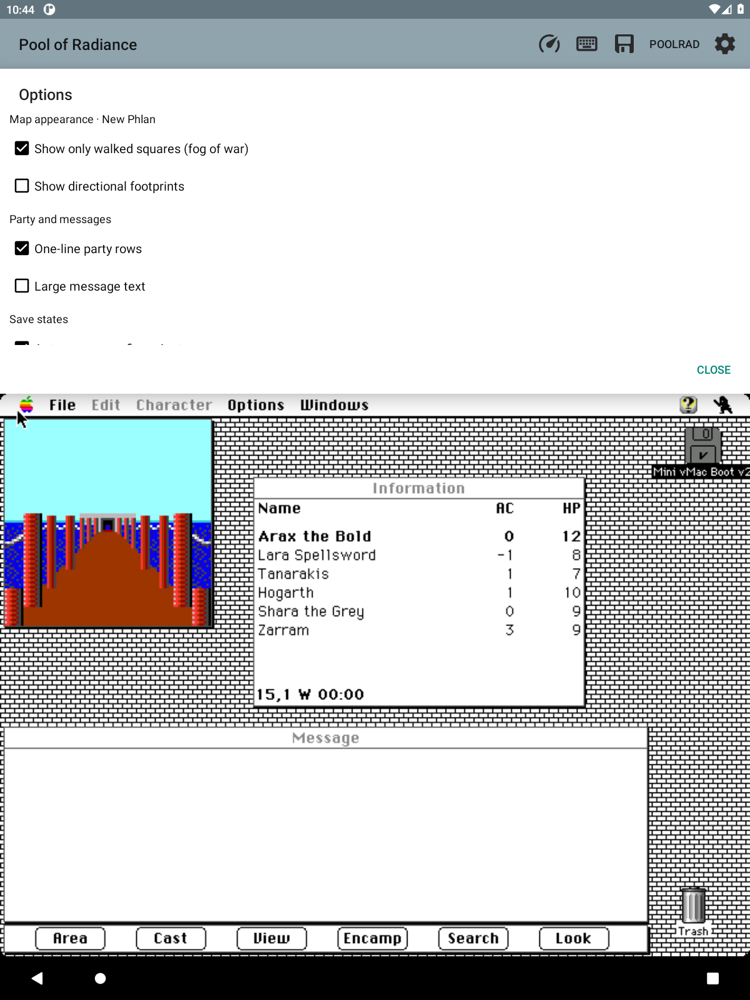

# Companion options

F29 puts the companion switches under **Info → Options**. Settings →
**Companion options…** opens the same page, revealing the companion first if
it was hidden. The page stays above the guest and scrolls on short displays.

The page contains:

- Show only walked squares (fog of war).
- Show directional footprints.
- Original area tile size (1:1): 32 physical pixels per tile, with drag scrolling.
  Off by default; saved globally. Tap the map header to find the party.
- Enter shortcut placement: bottom right of the map (default), bottom right of
  the screen, bottom left of the map, bottom left of the screen, or Off.
  Applies immediately and is saved globally.
- One-line party rows.
- Large message text.
- Auto-save every five minutes, retaining the latest 20 automatic states. A
  tick with nothing new since the last snapshot is skipped (F103).

Every change applies immediately. The first two choices belong to the area
named on the page. Before an area is available, they set defaults for areas
without their own saved choices. A page opened for one area never silently
changes another area's preferences if the guest moves while it is open.
Existing global and per-area preference keys are retained. The original-size choice
keeps the companion map, notes, markers and known-exit previews. It changes the
exploration viewport only; the battle overview and reference previews retain
their own layouts.

The old map-corner switches have moved here, giving their space back to the
header. Enter defaults to the map's lower-right corner. Its placement option can move it
to the left corner or onto the emulated screen, or remove it entirely. Screen
placements stay above the keyboard and inside the app's usable screen bounds;
map placements follow the map pane and disappear when that pane is hidden.
Choosing the map's left corner shifts zoom controls aside. The shortcut uses
the same guest Return key path as the on-screen keyboard, with a 48dp touch
target and no click passed through to the game underneath. Exploration trail still
shows route history and its confirmed clear/reset actions, with a link to
Options. Emulator settings and game-file backups remain in Settings.

The Android build and 638 Java tests pass. Eight companion-navigation checks
cover every tool route, scrolling, large text, keyboard focus, and stable guest
bounds; 26 map/party render checks also pass. Live checks confirm the preexisting
choices appear and global changes survive closing/reopening the page.
Live per-area fog/footprint changes updated the map immediately. The Settings
shortcut revealed a hidden companion and reopened the same choices; the page
remained above the guest. Test preferences were restored afterward.

No physical-tablet retest is claimed. The reusable Android UI helper now reports
checkbox state; the render-check script includes generated resources so the
navigation checks run through the same entry point as map checks.
