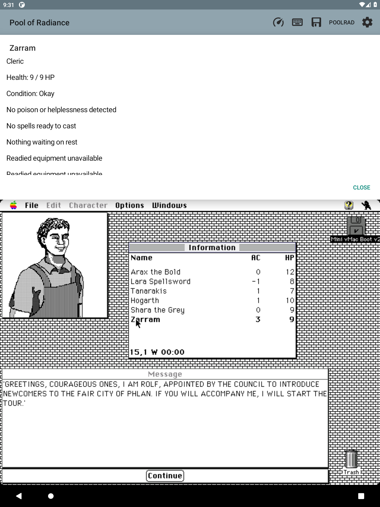
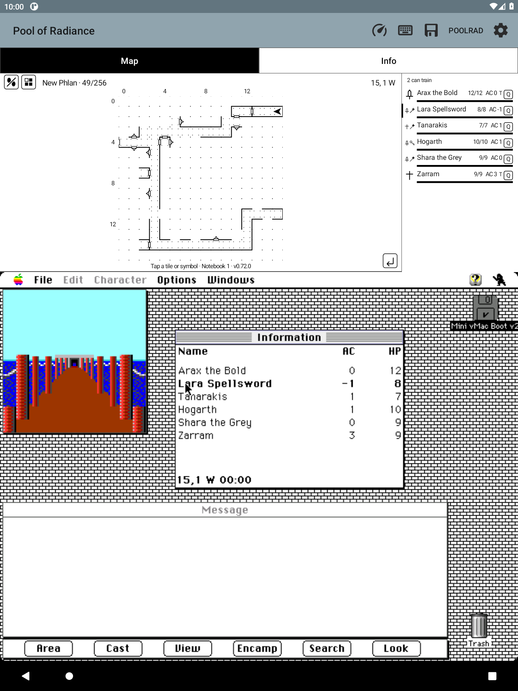

# Selecting a party member in the original game (F89)

Read-only decoding against the Macintosh 1.1 executable and private RAM
captures on 2026-09-19. A companion tap goes through ordinary guest mouse
input. It never writes the selected-character field.

## Evidence

- CODE2 `+0x5e04..0x5fb4` creates and manages the Information window at
  `A5-0x6118`. `A5-0x60a8` can also refer to it, but is used for other
  character-information presentation; it is not the canonical window pointer.
- CODE2 `+0x5e5c..0x5e82` computes the font line height at `A5-0x5eb6`.
- CODE2 `+0x5628..0x575c` handles the click. It requires the byte at
  `A5-0x6168`, converts the mouse to local coordinates, and computes
  `row = (localY + lineHeight/2) / lineHeight - 2`. It walks the roster from
  `A5-0x519e` to that row and stores its handle at `A5-0x51a2`.
- In `scratch/old/m1-slums-settled.ram`, the window is `0x66961c`, its
  content region is `(left=271, top=40, right=552, bottom=216)`, and its line
  height is 16. The six row targets are `(283,72)` through `(283,152)`.
- The live WindowRecord has kind 8 at +108, visible at +110, structure-region
  handle at +114, content-region handle at +118, Pascal title handle at +134,
  and next window at +144. The low-memory WindowList is at `0x9d6`. The title
  resolves to exactly `Information`.

`tools/disassemble-game.py` accepts a private resource fork and CODE segment
and prints an offset range or matching instruction-aligned byte references.
It replaces the old scratch script whose extraction/venv paths had gone stale.
Requires locally installed `capstone` and `macresources`; no game data ships.

## Guards

The whole party must validate. The requested name/class must match exactly one
member in a fresh sample, so a reorder cannot redirect the tap. A request older
than one second is refused. The native reader checks window kind, title,
visibility, bounded regions, font height, screen bounds and the input-enabled
flag. It walks the bounded window chain and refuses a target covered by a
front window's structure bounds, including dialogs. Hidden or unreadable
windows are never assigned guessed coordinates.

The companion details sheet remains available on tap. The guest click is a
bounded mouse press/release, using the same input bridge as direct touch.

## Verification

`tools/test-party-selection.c` uses the existing synthetic party fixture and
checks all six targets, movement, input disabled, hidden/mistitled windows,
invalid handles, occlusion, cycles, bounds and byte-for-byte unchanged RAM.
An optional private RAM argument reports targets against a captured game.
`PartySelectionTargetTest` covers reordered, missing, ambiguous and unreadable
party identities. Live acceptance is recorded with the release after it runs.

Reused prior Deja session `1d01c279-196b-4165-83cb-2031016bb071` for the
Information-window research lead; the offsets above were independently checked
in the local executable and capture, not inferred from the recalled excerpts.

### Live acceptance, 2026-09-19

On isolated `emulator-5586`, loaded SampleParty through the game's Command-L
and standard file dialog. Tapping Lara in the companion changed selected
handle `0x68eb6c` (Arax) to `0x68eb78` (Lara); the original Information window
bolded Lara, while the companion details sheet remained above the guest.
Then dragged Information from `(271,40)-(552,216)` to
`(217,90)-(498,266)`. Tapping Zarram changed selection to `0x68ecec`, Zarram's
actual handle, at the new window position. Private captures are
`scratch/f89-before-selection.ram`, `f89-after-lara.ram`, and
`f89-after-move.ram`. `tools/inspect-guest.py` reproduces the identity and
window-rectangle comparison. No physical tablet acceptance is claimed.

## Selected-character marker — F66, 0.73.0

The party pane marks the game's selected character with the same narrow black
left-edge bar used for the acting combatant. Both normal and compact party rows
support it. The accessibility description says “selected” outside combat and
“acting” during combat. Loading/updating/unavailable modes show no selection bar.

The existing verified selected handle at `A5−0x51a2` is compared against the
complete validated party chain. A null, unmatched, or monster handle produces
no marker. It is never dereferenced independently. `PRP8` uses header byte 5:
zero means unknown, otherwise the value is the one-based emitted party row.
Packet size and all PRP7 fields are unchanged. The Java parser accepts versions
1–7 with selection unknown, bounds the new index by party count, and includes
selection changes in display equality. Combat continues to use its own actor
reading and takes precedence over the general selected handle.

The research lead was recalled from Deja session
`1d01c279-196b-4165-83cb-2031016bb071`; the pointer evidence below was measured
independently for F89. Tests cover every selection-byte value, legacy packets,
selection-only redraws, stale handles and selected monsters.

Live on `emulator-5586`, the installed F66 build loaded `ExportProof`, marked
Arax, then moved the bar to Lara when the companion row selected her in the
original game. The guest bolded Lara and accessibility explicitly reported
“Lara Spellsword (selected).” Enabling one-line party rows retained the correct
marker. Screenshots were inspected in both layouts. Native party and selection
suites passed under address/undefined-behavior sanitizers; 636 Java tests passed
with no failures, errors or skips. No new physical-tablet test is claimed.
All 16 Android combat/party render checks passed, including both selected-row
layouts, combat actor precedence, and removal of selection wording during loading.

