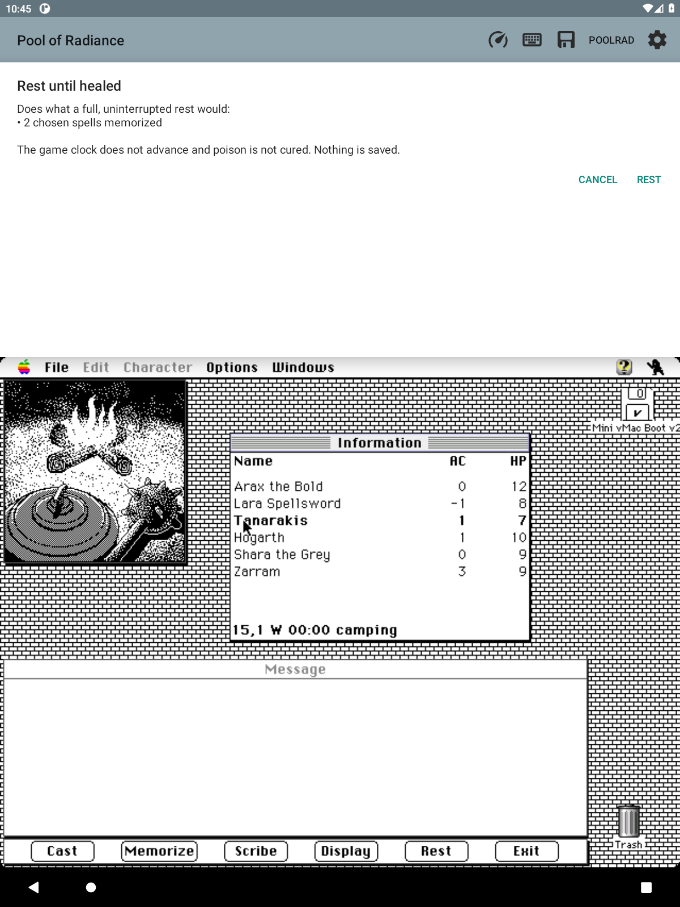

# Rest until healed

**Included in the published 0.101 APK.**

Open **PoolRad → Rest until healed** outside a fight. Review the preview, then
choose **Rest** to apply it or **Cancel** to leave the party alone.

For characters marked Okay, Unconscious or Dying, the helper:

- Restores full hit points.
- Wakes Unconscious and Dying members.
- Makes spells chosen at **Magic → Memorize** ready to cast.

Choose spells before using the helper. Leaving camp clears unmemorized choices.

The game clock stays where it is. Poison and helplessness remain. Dead,
petrified and absent members stay as they are. The helper refuses during a
fight or when it cannot read the party.

**Nothing is saved.** Use Quick save or the game's own save afterward if you
want to keep the result.

*Development-build preview from the rest-helper test. This party only needed
spell memorization; a hurt party gets a different preview.*

Live emulator testing confirmed that two chosen spells became ready in the
original game's Cast list, with no clock change. Healing and waking fallen
members were verified with code tests and a captured game-memory fixture;
those changes were not exercised on a live injured party in that session.
[Implementation and verification](PARTY.md#rest-until-healed-f52-2026-09-19).

## Companion HP refresh — 0.106.0

A successful rest now counts as activity and wakes emulation, matching the
existing bandage and quick helpers. The companion's existing post-rest party
sample reads back the resulting HP without requiring a character tap.
No character selection or gameplay input is synthesized.

Live acceptance on the owned emulator used a party injured in an actual fight:
Arax had 7/12 HP and Lara had 6/8 HP. After **PoolRad → Rest until healed → Rest**,
the companion displayed 12/12 and 8/8 without selecting either character.
The rest log reported two healed; the screenshot and recording retained the
same selected character, position (Slums 2,11 south), and game time (00:47).
Dead members remained dead.

The original game's small Information window retained its previous pixels.
The product lead confirmed that the companion display is the acceptance target;
original-game window redraw changes are outside this fix.

Evidence is retained locally under ignored scratch paths:
`rest-refresh-candidate-ready.png`, `rest-refresh-fixed-after.png`, and
`rest-refresh-first-attempt.mp4`. The development build also contained an
experimental original-window invalidation; that ineffective experiment was
removed before release. The successful-rest activity wake remains.

Prior rest behavior and fixture guidance were reused from
[PARTY.md](PARTY.md#rest-until-healed-f52-2026-09-19) and Deja session
`1d01c279-196`.
