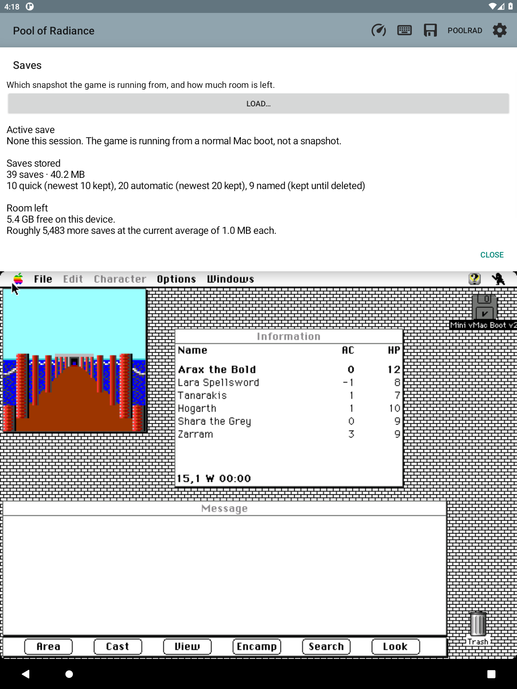

# Save states: real save/load outside the game

Current 0.85.0 format: **PRQS4 / PRSS3**, with model-aware device traversal
and required mounted-disk verification. PRQS1, PRQS2 and PRQS3 emulator
snapshots are unsupported. Original-game saves are unaffected.
[Automatic launch restore](AUTO_LOAD.md) describes F34 and its acceptance checks.

The earlier sections retain the implementation history; F97 below describes
the disk-consistency requirements. F34 testing found that the old OS-glue
coordinator did not see model-specific device flags, so its VIA/RTC calls were
compiled out despite the earlier description. Those tests proved specific
in-process behavior, not complete device capture or a fresh-process resume.
The coordinator now runs inside model-aware GLOBGLUE and has an independent
device-inclusion regression test.

## Why

The game only offers *Load Saved Game* before a game begins. Reaching that point
from inside a running game meant restarting the emulated machine, and a restart
that did not come back cleanly wedged a real device badly enough to need a
force-reboot. Load was withdrawn (0.58.0).

The way out is to stop using the game's menus at all. Snapshot the whole
emulated machine and swap it back in later — no File menu, no restart, no way to
strand the machine. That is what an emulator save state is.

## The theory (owner's), and why it holds

A full machine snapshot is dominated by one thing: **8 MB of emulated RAM**.
Everything else — the 68k registers, the VIA, the Sony floppy driver, the RTC,
the SCC, sound, the screen device — is a few hundred bytes to a few KB. So a
naive save state is ~8 MB, which is why whole-machine save states were dismissed
before.

But this build only ever runs one thing. So:

- **Bake in one reference state R** — a fresh boot with the game running, at a
  known idle point. Compressed, this is ~1–2 MB in the APK.
- **A save is R plus a diff.** Minutes into play, almost all of RAM is identical
  to R — the Mac OS, the game code, untouched heap — so the difference
  compresses to tens of KB. That is the ~17 KB scale the game's own saves have,
  reached a different way.
- **Keep R's RAM resident** (a second 8 MB buffer) so a save diffs against it and
  a restore applies onto it without touching a file mid-operation.

Restoring: pause at a safe boundary, write R's RAM, apply the diff, restore the
small CPU+device blob, resume. The game never knows it happened.

## What is genuinely hard, stated plainly

**Not the diff, and not the space. The full-machine capture and restore.**

Mini vMac was not built for save states, and this fork has none. Every stateful
global across the device modules and the CPU has to be captured and restored
*consistently*, or the machine glitches or hangs on resume. Miss one pending
interrupt or timer and the resume is wrong. This is the bulk of the work and
where the risk lives.

Two things make it tractable:

- The non-RAM state is small and each device module keeps its state in a known,
  localized set of globals.
- Snapshotting always at the **same controlled boundary** — between frames, at a
  VBL, with no disk I/O in flight — means the device state is in a predictable
  configuration every time, not an arbitrary one.

## The sequence — do not skip Phase 1

1. **F90 — round-trip the whole machine — PASSED 2026-09-19.** The whole
   machine (RAM + CPU + VIA1 + VIA2 + RTC + timing + interrupt state, 8,388,816
   bytes) captures and restores. Two proofs on the running Mac II: the in-place
   self-test is byte-identical, and the behavioural test is decisive — saved at
   *Party at 0, 4 W*, walked the party to *15, 4 W*, restored, and the party
   snapped back to *0, 4 W* with the game still live (it went on to raise a
   random orc encounter, which only a running CPU can do). Serial and sound are
   deferred and did not stop the resume; whether ADB (keyboard) state needs
   adding will be settled when F92 gives a clean on-demand trigger to test
   repeatedly. **The make-or-break is behind us: the approach works.**

2. **F91 — the reference and the diff — PASSED 2026-09-19.** The space
   optimization on top of a proven round-trip. One correction to the theory
   below: **R cannot be baked into the APK.** A machine image depends on the
   player's own ROM, system and game, none of which the app ships, so there is
   no build-time image to bake. Instead the **first save becomes the local
   reference template** — exactly the owner's words, "the first one" — written
   once and kept (gzipped, ~0.7–1.3 MB), and every later save is a byte-wise XOR
   against it, gzipped. Where a save matches the reference the XOR is zero and
   compresses to almost nothing, so an unchanged save is ~8.7 KB and a typical
   save is tens of KB.

   All of this lives in `SaveStateStore` — the emulator core is untouched. XOR
   reconstruction is exact no matter how similar the reference is (the image is
   always `reference XOR (reference XOR image)`); the only requirement is the
   same reference bytes at save and load, which a persistent file and a CRC
   check guarantee. A save whose reference is missing or mismatched is refused
   rather than reconstructed wrongly. F97 later withdrew old-format loading.

3. **F92 — save and load from the companion — PASSED 2026-09-19.** Outside the
   game entirely: Quick save, Quick load, and Save states… (name / list /
   delete) on the PoolRad menu. The save is asynchronous — the request returns
   at once and the machine image arrives later on the emulation thread, where it
   is gzipped and written atomically off-thread; load is the mirror. It cannot
   strand the machine because it never uses the game's menus and never restarts.

   Verified live on the running Mac II: Quick save wrote a valid file (store
   magic `PRQS1`, gzip of the whole-machine image); after a visible change, Quick
   load reverted the state, confirmed both logically (a text field's real content
   snapped back) and visually (a Finder selection re-appeared on a still screen).

   **The video buffer had to join the snapshot.** The Mac II keeps its screen in
   a separate 512 KB video buffer (`VidMem`), not in main RAM, so the first cut
   restored the machine correctly but left stale pixels on any screen the game
   was not already repainting. `VidMem` is now captured in `GlobGlue_VisitState`,
   and a restore raises `NeedWholeScreenDraw` so the host re-blits the whole
   screen at once. A save is ~8.9 MB raw, ~1.3 MB gzipped.

4. **F93 — pair each save with its notebook, by reference — PASSED 2026-09-19.**
   A save records *which* notebook it belongs with, rather than copying the ink.
   The notes and journals already live on disk (the notebook store); the save
   keeps only the notebook's id, in a ~36-byte sidecar (`<save>.prqs.notebook`),
   captured at save time. Loading a save opens that notebook, so restoring a
   machine state also brings up the right campaign, at no real size cost. A save
   whose notebook was deleted originally kept the current notebook; F35 below
   replaces that unsafe fallback. The sidecar is removed when its save is deleted. Verified live with
   two notebooks: a save made under one was restored while the other was active,
   and the active notebook switched back to the paired one.

## 0.70.0 — quick history and screen previews

Quick save publishes a new state before retiring the oldest of ten. Monotonic
sequence numbers, not the wall clock, decide rotation order; multiple captures
in one millisecond and clock rollback cannot overwrite a slot. The old
`quick.prqs` remains the oldest entry until it naturally ages out. Named and
automatic saves are outside the `quick-history/` namespace.

Quick load immediately restores the newest successful quick save. Load… shows
all quick, named and automatic saves, with thumbnails and local timestamps including seconds,
year and time zone. Selecting one opens a larger preview and confirmation, all
above the guest. Each save has an optional `.png` alongside its `.notebook` link;
rotation and deletion remove both. Missing or corrupt previews do not block a
valid state from loading.

The native callback copies at most 384×288 pixels at the same stopped boundary
as the machine snapshot. PNG encoding and all file I/O run on the controller's
single worker, not the emulation/UI thread. The existing reference/diff format
is unchanged. One request retains its own destination and notebook through
publication, preventing a manual save and autosave from exchanging metadata.

## F35 — unknown campaigns and restore completion

A state with an existing notebook binding prepares that exact notebook. A
missing, deleted or absent binding offers **Create separate notebook and load**
or **Cancel load**, before changing the guest. Cancel preserves the current
game and campaign. An accepted new notebook is paired back to that save, so
later loads return to the same campaign rather than repeatedly creating books.

Notebook recording pauses before the native restore request. During the
transition there is no active notebook or journal, old map readings are cleared,
and the trail recorder forgets its previous continuity. The native core now
reports actual success/failure at the emulation boundary. Success opens the
prepared campaign; rejection restores the previous notebook. Newly created
campaigns do not inherit legacy unassigned journal entries.

The persisted selection is marked pending during this transition. If the app
is interrupted before it completes, notebook initialization refuses to fall
back to another campaign; open Notebooks to choose one explicitly. Notebook
storage errors similarly leave recording unavailable rather than use the wrong
campaign. Binding-write failures are reported and preserve the previous sidecar.

Native state length is checked against the current complete machine layout
before any fields are changed. This fixes partial application of a truncated
body; it does not resolve the separate disk-content problem below.

### F35 acceptance — 2026-09-19

On the disposable emulator, an unbound quick save offered a separate notebook;
Cancel kept Lara selected and every original notebook file unchanged. A missing
binding then created Notebook 2, restored Arax, and remembered that pairing.
Notebook 2 began with one walked square; Notebook 1 retained its 49-square
trail and byte-identical files. A repeated quick load reused Notebook 2 without
another prompt. A known Notebook 1 binding switched back to that campaign.

A valid container with a deliberately truncated native body reached the core,
reported actual restore failure, and preserved the verified Lara selection
and Notebook 1 even though the fixture named Notebook 2. The reusable private
fixture generator is `tools/MakeRejectedState.java`. The first selection
precondition did not take effect; the decisive retry checked it before loading.
638 Java tests passed, including absent/deleted bindings and failed sidecar
replacement. The universal Android build passed. No physical-device retest
or disk-mismatch fix is claimed.

## F97 — required disk verification

PRQS3 records each mounted drive's slot, write protection, byte length and
SHA-256 alongside the existing full/diff payload. Capture hashes the actual
mounted files on the worker thread; any intervening disk write or mount refuses
the capture. Load compares fresh hashes before changing the notebook and
checks the proof again at the native restore boundary. A mismatch leaves the
running game and notebook intact.

PRQS1 and PRQS2 are refused with a clear unsupported-format message, following
the owner's pre-1.0 decision. There is no compatibility mode or override.
The PRQR1 reference remains a reusable compression dictionary. Missing optional
screenshots do not block valid PRQS3 snapshots.

These are RAM/CPU/device/video snapshots, not disk backups. Restores require
matching disk contents; they can be refused after normal shutdown or reboot
changes the disk. Abrupt process death can still leave HFS metadata inconsistent.
The disposable audit reproduced this and showed that a later clean shutdown
did not repair it. Use normal Mac shutdown and independent disk backups.

Both reference and snapshot writers now finish the gzip trailer, flush and
fsync the still-open descriptor before atomic publication. Sync failures
preserve earlier saves and history. The cached reference owns its bytes so
caller mutation cannot invalidate previous diffs.

See [the disk-safety audit](DISK_SAFETY.md) for the implementation, evidence and
remaining limitations. Notebook ZIP exports contain notebooks/trails/fog,
not these state files or the shared reference.

## F98 — Info → Saves

**Info → Saves** answers two questions at a glance without opening Load…:
which snapshot the game is running from, and how much room is left.

- **Active save**: the quick, named or automatic snapshot most recently
  loaded (including the automatic launch restore), or the quick/named save
  made after it, with the time. Autosaves never become the active save, so
  the name stays the one the player chose. A normal Mac boot says so plainly.
  If the active file has since been deleted or rotated out, the page still
  names it and says so.
- **Saves stored**: total count and bytes on disk (snapshots, sidecars and the
  shared reference), split into quick (newest 10 kept), automatic (newest 20
  kept) and named (kept until deleted).
- **Room left**: free space on the device and roughly how many more saves fit
  at the current average snapshot size, keeping a 64 MB floor. Under that
  floor the page says to delete old saves in Load… instead of estimating.
  A brand-new player sees "No saves yet" and an estimate that reserves the
  first save's reference template.

The text is pure Java (`SaveStatus`, `SaveStateStore.usage()`) and refreshes
once a second while open, bounded above the guest like Money and Marching
order. **Load…** on the page opens the existing picker, whose Delete… is the
cleanup path. Nothing in the guest or on any disk is changed.

### F98 acceptance — 2026-09-19

On the disposable sandbox emulator-5586 (0.85.0 → this build, installed after
a normal Mac shutdown with `tools/update-test-app.py`, then ExportProof loaded
through the original game's picker):

- Normal boot: "None this session. The game is running from a normal Mac
  boot, not a snapshot." with 38 saves · 38.6 MB, 9 quick / 20 automatic /
  9 named, 5.4 GB free and a rounded estimate of more saves. The page sat
  entirely above the guest with **LOAD…** and **CLOSE**.
- After PoolRad → Quick save: "Quick save Sep 19 '26 · 4:11:25 PM PDT /
  Saved 4:11 PM", 39 saves, 10 quick.
- After **LOAD…** → that quick save → Load (native "Restore completed:
  true"): the same name with "Loaded 4:12 PM". An autosave that landed in
  between did not change the active save.
- Brand-new player: with the save folder briefly moved aside (restored intact,
  82 entries, no autosave fell in the window), the page showed "Saves stored /
  No saves yet." and the estimate reserving the reference; the active save was
  still named with the "since been deleted or rotated out" note, which is the
  correct reading for that state. The true fresh-install "None yet." text is
  covered by `SaveStatusTest`.

688 Java tests passed. No physical device was used; nothing in the guest or on
any disk image was changed by the page.

*Captured from the F98 test build during the acceptance checks above.
Source: `poolrad-macmaps-for-claude/scratch/f98/saves-final.png`.*

## F103 — autosaves that have nothing to protect

The five-minute autosave used to run whether or not anything had happened,
paying for an 8 MB capture, gzip and a disk fingerprint each time. It now asks
`AutosaveGate` first, and skips the tick when nothing has moved since the last
protected point.

Activity is anything that could have changed the machine:

- a guest key or mouse press (`Core.inputEvents()`),
- a party, map or message sample that differs from the previous one (the same
  change-only comparison the companion uses to redraw),
- a disk write, mount or unmount (`DiskSnapshotGuard.revisionCount()`).

A protected point is a successful snapshot of any kind (automatic, quick or
named) or a completed restore, since the loaded snapshot already holds that
exact state. Activity that arrives while a save is still compressing counts
toward the next tick: the published image predates it. A failed capture or
write never skips; the next tick saves.

What is unchanged: the interval, the 20-autosave rotation, the snapshot format,
and every guard on the write path. A player who walks, fights, rests, saves
the game or even opens a menu still gets the next autosave. Only a genuinely
idle period is skipped, and the log says so.

### F103 acceptance — 2026-09-19

On the disposable sandbox emulator-5586, after a normal Mac shutdown and
install, with `f97guard` loaded through the original game's picker and the
party standing at 15,1 W in New Phlan (`PoolRad.Autosave` log):

- First tick after the load (20:20): `Requesting: party changed` →
  `Saved AUTO`. The load itself is the change; there was no protected point.
- Second tick, nothing touched for five minutes (20:25):
  `Skipped: nothing new since the last snapshot (skipped 1, saved 1)`.
- Third tick, after one turn key between ticks (20:30): `Requesting: guest
  input` → `Saved AUTO`. The turn also logged `map changed: position/display`.

An earlier build compared raw party packets and did not skip the idle tick:
a transient party-probe refusal packet differs from a normal one and read as
"party changed". The observers now compare parsed party states, parsed
message text, and map mode/clock/position with unreadable and updating frames
ignored, and log which reading moved. Unit tests cover the gate's rules
(first save, activity, input and disk counters, mid-save activity, failure,
restore); the observers are fragment code exercised only live, as above.

Two shutdown/reinstall cycles needed manual Finder steps because OCR timed
out on a heavily loaded host; the OCR timeouts in `tools/shutdown-test-guest.py`
and `tools/load-test-save.py` were raised. No physical-device battery
measurement was made.

## F36 — the game's own save prompts (2026-09-19)

<<<<<<< HEAD
The companion's save and load actions do not open the game's save or overwrite
prompts. F36 was closed without an app change.

- **Code:** Quick save, named saves, autosaves, fight-end saves and restores use
  emulator snapshots. `SaveStateController` calls `Core.requestSaveState()`
  and `Core.restoreState()`; neither action selects a game menu.
- **Withdrawn loader:** `SaveBackupController` no longer offers its
  restart-based load option. `EmulatorFragment.loadSavedGame()` has no caller;
  its `LoadSequence` and `sendCommandKey()` plumbing remains unused.
- **Live check:** A quick save and a load completed on the sandbox while the
  game showed its treasure screen. Only the treasure animation changed.
  No game dialog, prompt or message appeared.
- **Player choices:** The game's own Save Current Game, Camp → Save,
  overwrite and quit confirmations remain the player's to answer. F61 ruled
  out answering these choices on the player's behalf.

Removing the unused restart-loader plumbing would be separate cleanup.
=======
Question: now that the companion has its own save system, does the game still
put its save-and-overwrite questions in front of the player on any path, and
should the companion answer them?

Answer: no path the companion drives reaches them, so nothing was built.

- **Code.** Every companion save (Quick save, named Save…, the five-minute
  autosave, the fight-end quick save) and every restore (Load…, Quick load,
  launch restore) is an emulator snapshot: `SaveStateController` and the native
  capture, never a game menu. The only guest input the companion generates is
  the boot dialog's Return (F30), the code-wheel answer plus Return, the V key
  for a character sheet the player asked for (F43), the party-selection click
  (F89) and the player's own keyboard and trackpad. `sendCommandKey` exists
  only for `LoadSequence`, the withdrawn F86 restart-based loader, whose entry
  point `loadSavedGame` has no caller. Nothing sends Cmd-S or the camp's Save.
- **Live.** On the sandbox, with the game showing its treasure screen, a Quick
  save and then a Load… of that save each completed (`Saved QUICK`,
  `Restore completed: true`) while the guest screen stayed the same apart from
  the treasure pile's own animation; no dialog, no prompt, no Message text.
- **What remains the player's.** File → Save Current Game…, Camp → Save, the
  Standard File "Replace existing?" and "Do you really want to quit?" appear
  only when the player chooses those commands. Answering them on the player's
  behalf was ruled out when F61 was dropped: that is the player answering the
  game, not the helper acting for them.

Follow-up worth its own item: `LoadSequence` and `loadSavedGame` are dead
code since F86 was withdrawn and could be removed.
>>>>>>> 36203cc (Close F36: no companion path reaches the game's own save prompts)

## How this relates to the game's own save format

The record and save-file work already done (F77, F78, F82, F85) is **not
wasted and not replaced**. It serves a different feature: the converter (F81),
which imports parties other people saved on other platforms. That reads and
writes the *game's* format. This save-state line is for the player's own
save/load of their own session. The two coexist.

## Boundary

This is emulator-core work. The exclusions list rules out *emulator rewrites*;
adding save-state support is a feature addition in service of the companion, not
a rewrite, and the owner has named it the P0 line. A save state is inherently
tied to the machine configuration it was taken on — the same ROM and the same
emulator variant — which is fine for a single-purpose app, and is why the
reference R is created locally from the first capture, never baked into a build.
