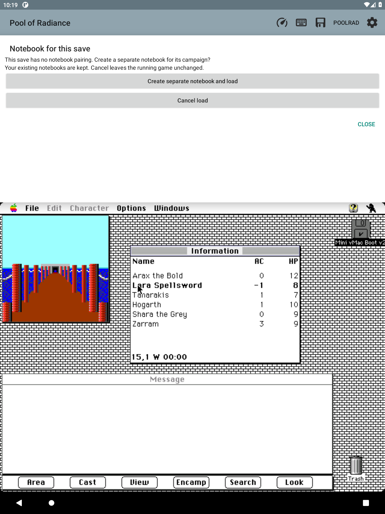

# Save states: real save/load outside the game

Owner's direction, 2026-09-19, and the new P0 line of implementation.

## Why

The game only offers *Load Saved Game* before a game begins. Reaching that point
from inside a running game meant restarting the emulated machine, and a restart
that did not come back cleanly wedged a real device badly enough to need a
force-reboot. Load was withdrawn (0.58.0).

The way out is to stop using the game's menus at all. Snapshot the whole
emulated machine and swap it back in later — no File menu, no restart, no way to
strand the machine. That is what an emulator save state is.

## The theory (owner's), and why it holds

A full machine snapshot is dominated by one thing: **8 MB of emulated RAM**.
Everything else — the 68k registers, the VIA, the Sony floppy driver, the RTC,
the SCC, sound, the screen device — is a few hundred bytes to a few KB. So a
naive save state is ~8 MB, which is why whole-machine save states were dismissed
before.

But this build only ever runs one thing. So:

- **Bake in one reference state R** — a fresh boot with the game running, at a
  known idle point. Compressed, this is ~1–2 MB in the APK.
- **A save is R plus a diff.** Minutes into play, almost all of RAM is identical
  to R — the Mac OS, the game code, untouched heap — so the difference
  compresses to tens of KB. That is the ~17 KB scale the game's own saves have,
  reached a different way.
- **Keep R's RAM resident** (a second 8 MB buffer) so a save diffs against it and
  a restore applies onto it without touching a file mid-operation.

Restoring: pause at a safe boundary, write R's RAM, apply the diff, restore the
small CPU+device blob, resume. The game never knows it happened.

## What is genuinely hard, stated plainly

**Not the diff, and not the space. The full-machine capture and restore.**

Mini vMac was not built for save states, and this fork has none. Every stateful
global across the device modules and the CPU has to be captured and restored
*consistently*, or the machine glitches or hangs on resume. Miss one pending
interrupt or timer and the resume is wrong. This is the bulk of the work and
where the risk lives.

Two things make it tractable:

- The non-RAM state is small and each device module keeps its state in a known,
  localized set of globals.
- Snapshotting always at the **same controlled boundary** — between frames, at a
  VBL, with no disk I/O in flight — means the device state is in a predictable
  configuration every time, not an arbitrary one.

## The sequence — do not skip Phase 1

1. **F90 — round-trip the whole machine — PASSED 2026-09-19.** The whole
   machine (RAM + CPU + VIA1 + VIA2 + RTC + timing + interrupt state, 8,388,816
   bytes) captures and restores. Two proofs on the running Mac II: the in-place
   self-test is byte-identical, and the behavioural test is decisive — saved at
   *Party at 0, 4 W*, walked the party to *15, 4 W*, restored, and the party
   snapped back to *0, 4 W* with the game still live (it went on to raise a
   random orc encounter, which only a running CPU can do). Serial and sound are
   deferred and did not stop the resume; whether ADB (keyboard) state needs
   adding will be settled when F92 gives a clean on-demand trigger to test
   repeatedly. **The make-or-break is behind us: the approach works.**

2. **F91 — the reference and the diff — PASSED 2026-09-19.** The space
   optimization on top of a proven round-trip. One correction to the theory
   below: **R cannot be baked into the APK.** A machine image depends on the
   player's own ROM, system and game, none of which the app ships, so there is
   no build-time image to bake. Instead the **first save becomes the local
   reference template** — exactly the owner's words, "the first one" — written
   once and kept (gzipped, ~0.7–1.3 MB), and every later save is a byte-wise XOR
   against it, gzipped. Where a save matches the reference the XOR is zero and
   compresses to almost nothing, so an unchanged save is ~8.7 KB and a typical
   save is tens of KB.

   All of this lives in `SaveStateStore` — the emulator core is untouched. XOR
   reconstruction is exact no matter how similar the reference is (the image is
   always `reference XOR (reference XOR image)`); the only requirement is the
   same reference bytes at save and load, which a persistent file and a CRC
   check guarantee. A save whose reference is missing or mismatched is refused
   rather than reconstructed wrongly, and old whole-image files still load.

3. **F92 — save and load from the companion — PASSED 2026-09-19.** Outside the
   game entirely: Quick save, Quick load, and Save states… (name / list /
   delete) on the PoolRad menu. The save is asynchronous — the request returns
   at once and the machine image arrives later on the emulation thread, where it
   is gzipped and written atomically off-thread; load is the mirror. It cannot
   strand the machine because it never uses the game's menus and never restarts.

   Verified live on the running Mac II: Quick save wrote a valid file (store
   magic `PRQS1`, gzip of the whole-machine image); after a visible change, Quick
   load reverted the state, confirmed both logically (a text field's real content
   snapped back) and visually (a Finder selection re-appeared on a still screen).

   **The video buffer had to join the snapshot.** The Mac II keeps its screen in
   a separate 512 KB video buffer (`VidMem`), not in main RAM, so the first cut
   restored the machine correctly but left stale pixels on any screen the game
   was not already repainting. `VidMem` is now captured in `GlobGlue_VisitState`,
   and a restore raises `NeedWholeScreenDraw` so the host re-blits the whole
   screen at once. A save is ~8.9 MB raw, ~1.3 MB gzipped.

4. **F93 — pair each save with its notebook, by reference — PASSED 2026-09-19.**
   A save records *which* notebook it belongs with, rather than copying the ink.
   The notes and journals already live on disk (the notebook store); the save
   keeps only the notebook's id, in a ~36-byte sidecar (`<save>.prqs.notebook`),
   captured at save time. Loading a save opens that notebook, so restoring a
   machine state also brings up the right campaign, at no real size cost. A save
   whose notebook was deleted originally kept the current notebook; F35 below
   replaces that unsafe fallback. The sidecar is removed when its save is deleted. Verified live with
   two notebooks: a save made under one was restored while the other was active,
   and the active notebook switched back to the paired one.

## 0.70.0 — quick history and screen previews

Quick save publishes a new state before retiring the oldest of ten. Monotonic
sequence numbers, not the wall clock, decide rotation order; multiple captures
in one millisecond and clock rollback cannot overwrite a slot. The old
`quick.prqs` remains the oldest entry until it naturally ages out. Named and
automatic saves are outside the `quick-history/` namespace.

Quick load immediately restores the newest successful quick save. Load… shows
all quick, named and automatic saves, with thumbnails and local timestamps including seconds,
year and time zone. Selecting one opens a larger preview and confirmation, all
above the guest. Each save has an optional `.png` alongside its `.notebook` link;
rotation and deletion remove both. Missing or corrupt previews do not block a
valid state from loading.

The native callback copies at most 384×288 pixels at the same stopped boundary
as the machine snapshot. PNG encoding and all file I/O run on the controller's
single worker, not the emulation/UI thread. The existing reference/diff format
is unchanged. One request retains its own destination and notebook through
publication, preventing a manual save and autosave from exchanging metadata.

## F35 — unknown campaigns and restore completion

A state with an existing notebook binding prepares that exact notebook. A
missing, deleted or absent binding offers **Create separate notebook and load**
or **Cancel load**, before changing the guest. Cancel preserves the current
game and campaign. An accepted new notebook is paired back to that save, so
later loads return to the same campaign rather than repeatedly creating books.

Notebook recording pauses before the native restore request. During the
transition there is no active notebook or journal, old map readings are cleared,
and the trail recorder forgets its previous continuity. The native core now
reports actual success/failure at the emulation boundary. Success opens the
prepared campaign; rejection restores the previous notebook. Newly created
campaigns do not inherit legacy unassigned journal entries.

The persisted selection is marked pending during this transition. If the app
is interrupted before it completes, notebook initialization refuses to fall
back to another campaign; open Notebooks to choose one explicitly. Notebook
storage errors similarly leave recording unavailable rather than use the wrong
campaign. Binding-write failures are reported and preserve the previous sidecar.

Native state length is checked against the current complete machine layout
before any fields are changed. This fixes partial application of a truncated
body; it does not resolve the separate disk-content problem below.

### F35 acceptance — 2026-09-19

On the disposable emulator, an unbound quick save offered a separate notebook;
Cancel kept Lara selected and every original notebook file unchanged. A missing
binding then created Notebook 2, restored Arax, and remembered that pairing.
Notebook 2 began with one walked square; Notebook 1 retained its 49-square
trail and byte-identical files. A repeated quick load reused Notebook 2 without
another prompt. A known Notebook 1 binding switched back to that campaign.

A valid container with a deliberately truncated native body reached the core,
reported actual restore failure, and preserved the verified Lara selection
and Notebook 1 even though the fixture named Notebook 2. The reusable private
fixture generator is `tools/MakeRejectedState.java`. The first selection
precondition did not take effect; the decisive retry checked it before loading.
638 Java tests passed, including absent/deleted bindings and failed sidecar
replacement. The universal Android build passed. No physical-device retest
or disk-mismatch fix is claimed.

## Disk-safety limitation (open F97)

These are RAM/CPU/device/video snapshots, **not matched disk snapshots**. No
guest write being in flight at the capture boundary does not imply that the
disk is unchanged when an older state is restored: the restored Mac may hold
cached filesystem metadata from before a later disk write. Quick loading is
not a corruption-prevention mechanism or a substitute for disk backups.

The user reports another agent observed corruption after hard quits, but has
not observed it personally. This has not been reproduced or fixed here.
Investigate process death and RAM/disk mismatch on disposable images (F97).
The local play helper now resumes rather than force-stopping a mounted guest.
Use normal Mac shutdown and independent backups. Notebook ZIP exports currently
contain notebooks/trails/fog, not these state files or the shared reference.

## How this relates to the game's own save format

The record and save-file work already done (F77, F78, F82, F85) is **not
wasted and not replaced**. It serves a different feature: the converter (F81),
which imports parties other people saved on other platforms. That reads and
writes the *game's* format. This save-state line is for the player's own
save/load of their own session. The two coexist.

## Boundary

This is emulator-core work. The exclusions list rules out *emulator rewrites*;
adding save-state support is a feature addition in service of the companion, not
a rewrite, and the owner has named it the P0 line. A save state is inherently
tied to the machine configuration it was taken on — the same ROM and the same
emulator variant — which is fine for a single-purpose app, and is why the
reference R is created locally from the first capture, never baked into a build.
