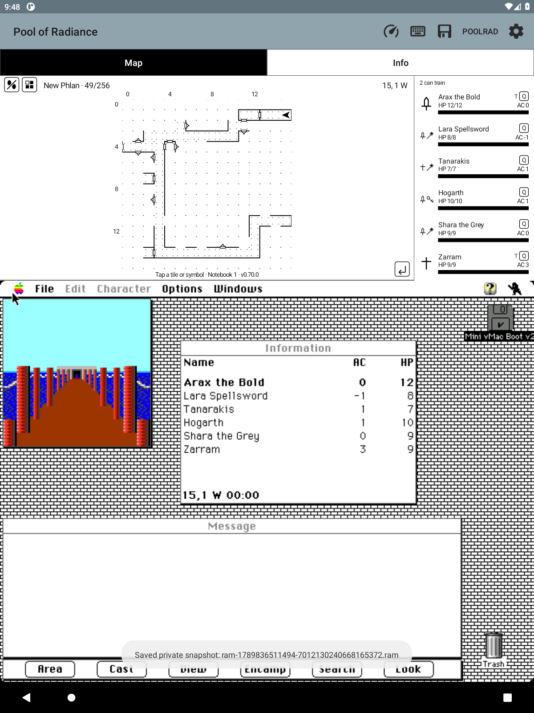

# Writing an original Macintosh game save

F79 adds `tools/write-game-save.py`, a dependency-free Python 3 writer for a
private RAM capture of Macintosh Pool of Radiance v1.1. It generates a new
original-game save, including the world state, party, inventory, and effects.
This is a host tool, not an Android menu action or an emulator snapshot.

```sh
tools/capture-ram.sh emulator-5586 scratch/current.ram
python3 tools/write-game-save.py scratch/current.ram scratch/new-save --name NewSave
python3 tools/test-save-writer.py
```

The game must be idle in local exploration. Combat, camp, wilderness, loading,
relocation and pending movement are refused. The application name, globals,
all allocation headers, complete party chain, inventories and effects are
validated. Cycles, shared/overlapping allocations, duplicate character names
or slots, and unknown classes are refused. Inventory/effect bounds are 256/64
per character; exceeding a bound refuses the whole export. These are tool
bounds, not claims about the game's limits.

The destination directory must not exist. Its contents are:

| File | Use |
| --- | --- |
| `save.bin` | MacBinary II file with both forks and Finder type `prdt`, creator `prad`; import with `hcopy -m` |
| `save.prsv` | Existing companion backup container, including CRC |
| `save.data`, `save.rsrc` | Exact individual forks for inspection |
| `manifest.json` | Party summary, source/output SHA-256 hashes, and an empty adjustments list |

No score, item, spell, condition, or world variable is invented or improved.
The writer performs the original game's save-time packing on private copies
and preserves all unknown record bytes. It never writes guest RAM or a disk.
Keep captures and generated saves private; they contain original game data.

## Loading the result

Use a new name on a **disposable, unmounted copy** of a compatible game disk.
Quit the game and shut down the Macintosh normally before obtaining that copy;
verify the emulator closed its disk handles and HFS is cleanly unmounted.
Keep the unchanged copy as a recovery point. Never run host HFS tools against
an image mounted by an emulator.

```sh
hmount scratch/disposable-copy.dsk
hcopy -m scratch/new-save/save.bin ':Pool Of Radiance:PoolRadSave:NewSave'
humount
```

Check that `NewSave` does not already exist before `hcopy`: unlike the writer,
that external command can replace a file. Boot the disposable image, use the
game's File → Load Game, and select the new save. The Android `.prsv` restore
currently requires an existing file of sufficient capacity and an unmounted
disk; it is not a new-file importer.

## How the writer was derived

Earlier F78 work established that character resources share the RAM record
layout and that the 7,680-byte world block is copied verbatim. Deja recall of
session `1d01c279-196b-4165-83cb-2031016bb071` supplied the F78/F79 research
sequence; the complete writer was independently
traced in the privately supplied v1.1 executable's CODE 2:

- `+0x37b6..0x386a`: save-time field packing.
- `+0x386e..0x39ac`: four handle contents and the trailer.
- `+0x39ae..0x3a68`: party count, names, and per-character serialization.
- `+0x245c..0x2698`: character resource, 66-byte inventory nodes, 10-byte effects.
- `+0x269a..0x28f0`: loader allocates and relinks the serialized lists.

The four stable handle globals are `A5−0x5eb2`, `−0x5eae`, `−0x5eaa`,
and `−0x5ea6`, with logical sizes 2,048, 2,048, 1,024 and 7,680 bytes.
Their heap addresses are never hard-coded. A resource contains 302 character
bytes, a big-endian 16-bit inventory count, exactly 66 bytes per item, a
big-endian 16-bit effect count, and exactly 10 bytes per effect. The apparent
variable item sizes in the early F78 notes were the following effects list.

Synthetic tests cover fork structure, exact record preservation, both counts,
save-time packing, source immutability, malformed/cyclic handles, prohibited
states, both container checksums, and refusal to replace an existing output.

## Live acceptance — 2026-09-19

Generated `ExportProof` from an 8 MB capture on `emulator-5586`, shut down the
Mac normally, verified no disk descriptors remained and HFS's clean-unmount
bit was set, then imported into a new copy of that disk. HFS readback reproduced
both generated forks exactly. The independent Java `SaveReadCheck` read all
six party members correctly.

After booting the copy, the original game's Load Game dialog recognized and
loaded `ExportProof`. The guest and companion both showed New Phlan 15,1 W
and the expected six names, AC and HP. A fresh RAM capture serialized all six
complete character resources **byte-for-byte identically**, including all 34
inventory records and seven effects. The data fork differed at one byte,
`0x0dc4` (8 → 255); its meaning is not claimed here. The other 12,905 bytes,
including the complete 7,680-byte world block, matched. This is a game-save
round trip, not a claim to preserve transient UI/script execution like a RAM
snapshot. The game selected the first character and resumed exploration.



`tools/verify.sh --fast` passed native suites, the writer's six synthetic tests,
634 Java tests (no failures/errors/skips), and universal-APK selection checks.
Two unrelated optional Python suites (`test-personal-boot.py` and
`test-prepare-journal.py`) skipped because their optional modules were absent
from the default interpreter. Device render checks were skipped; the actual
load screen above was inspected separately. No new physical-tablet test is claimed.
