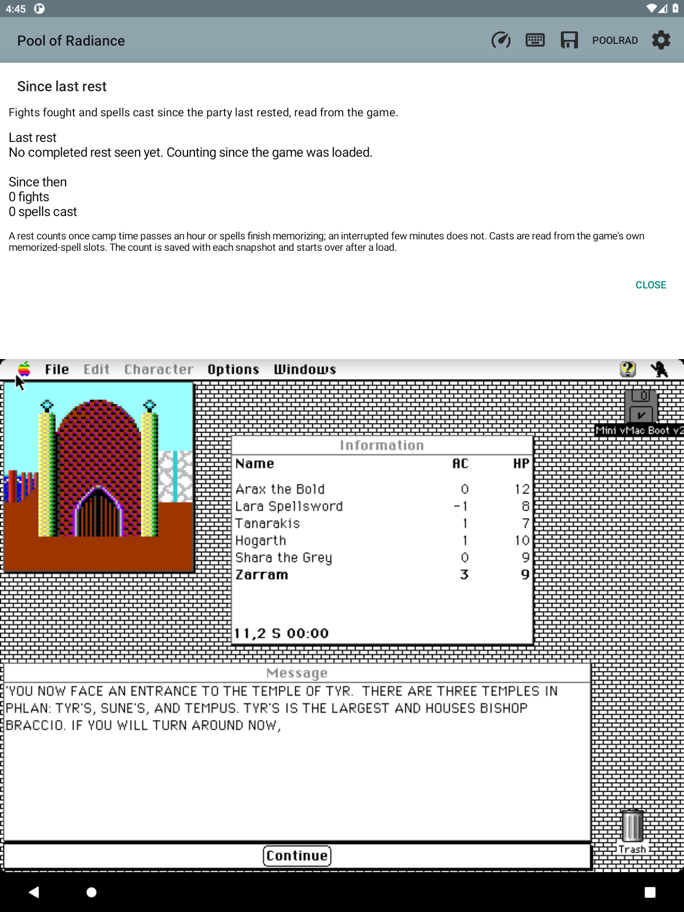

# Since last rest

**Info → Since last rest** answers "how long has it been?" with the two
numbers a player acts on: fights fought and spells cast since the party last
rested. It is read-only quick-glance information beside Saves, not a map
element, and nothing here touches the guest.

## What counts

| Event | Read from | Rule |
| --- | --- | --- |
| A fight | the map packet's mode byte | the named mode turns to Combat from anything but Combat; unreadable or Updating frames in between never add a second fight |
| A cast | the party packet's memorized-spell slots ([SPELL_READINESS.md](SPELL_READINESS.md)) | one character's ready total drops while their awaiting-rest total is unchanged; the drop is the number of casts |
| A rest | the game clock while in Camp, or the slots | camp time since entering camp reaches 60 minutes, or awaiting slots turn ready (the game only does that when resting) |
| A load | the game's own load screen, the clock, or a snapshot restore | the Loading mode is followed by a named mode, the clock runs backwards, or a snapshot without a tally is restored |

The party signal is deliberately not a load detector: the party probe's shared
guard refuses transiently during fights, rests and encounters, and an early
version of this page restarted its count on exactly that flicker.

Slot movement that is neither a cast nor a memorization — a chosen spell
added at the Memorize screen, a reset record, a new character — is ignored
rather than guessed at. Wilderness travel advances the clock outside camp and
is not a rest. A rest interrupted after a few minutes (the city watch in
New Phlan) does not reset the count; one that lasts an hour does.

## What the page says

```
Last rest
Day 1 · 8:05 am · 8 hours rested
1 hour of game time ago

Since then
1 fight
0 spells cast
```

Before any completed rest: "No completed rest seen yet. Counting since the
game was loaded at Day 1 · 12:10 am."



*Fresh-load view captured from the F59 test build.
Source: `poolrad-macmaps-for-claude/scratch/f98/rest-page-fresh.png`.
This image shows the starting counts; live-test limits are recorded below.*

## Snapshots

Every quick, named and automatic snapshot writes a small `.rest` sidecar next
to its `.notebook` and `.png`. Loading a snapshot adopts its tally, so a
restored machine reports its own count rather than the session's. A snapshot
without one, or with a malformed one, starts the count over as a load. The
snapshot format itself is unchanged; the sidecar is removed with its save.

`RestTally` and `GameClock.of` are pure Java; the fragment feeds them the
same map and party samples the live map already receives, on the UI thread.

## Acceptance — 2026-09-19

On the disposable sandbox emulator-5586, installed over normal Mac shutdowns
except once (see below), with `f97guard` loaded through the original game and
the party walked to the Slums.

Seen on the page:

- Fresh load: "No completed rest seen yet. Counting since the game was
  loaded." with 0 fights and 0 spells cast.
- Choosing two spells at the Memorize screen (Tanarakis, awaiting rest ×2 in
  the party details) left "0 spells cast": a chosen spell is not a cast.

Seen in the `PoolRad.RestTally` log (one line per mode change, clock jump or
count change) rather than on the page:

- Each fight raised the count on the Combat transition (`fights=1`) across
  three real Slums fights, with unreadable frames in between not counted.
- An eight-hour and a two-hour rest completed in camp with the clock jumping
  12:19 → 8:00 and 8:00 → 10:00 in one step while the companion stayed in
  Camp; a four-hour rest interrupted by orcs recorded `anchor=RESTED` at
  4:19 am. A five-minute rest rousted by the New Phlan city watch did not.
- The launch restore of an autosave written before this feature (no `.rest`
  sidecar) restarted the count as a load.

Why the page did not show those counts at the time: the party probe's shared
guard refuses transiently mid-fight, the first build treated that "no party /
no game → party" flicker as a load, and the count restarted. That reset is
removed; only the load screen, a clock rewind or a restore starts over. The
corrected detector is covered by `RestTallyTest`, not re-run live.

Not verified live: **spells cast**. Every rest in that session emptied the
chosen slots without a "has memorized" message, so no character ever held a
ready spell to cast. That turned out to be the game's own rule (only Magic →
Rest memorizes; the timed rest and leaving camp forget chosen spells; see
[SPELL_READINESS.md](SPELL_READINESS.md)), not a reader fault. The cast rule
rests on the documented slot semantics and unit tests. Also not verified live: a `.rest` sidecar round trip.

Process note: one APK install happened after the shutdown helper's OCR failed
to confirm the Finder and a fallback proceeded anyway, so the sandbox guest
may have been stopped without a normal Mac shutdown. `disk1.dsk` had not been
written since its 17:17 boot and the next launch restore verified matching
disk contents, but the sandbox image has not been HFS-checked (no `fsck_hfs`
on this host). Treat the sandbox disk as suspect until re-seeded.

### Quick toggle during combat

The companion's Q toggle was investigated after taps during one fight did not
take until the fight ended. With step-by-step logging (`PoolRad.Quick`: tap
row, queue accepted, native write, drain) every later mid-combat tap wrote at
once: `Q tap row 2 current=true mode=COMBAT` → `native write slot 2 on=false
-> true` → `drain … written=true`. No code change was needed for those taps.
The first fight's failure was not reproduced; the queue log now records any
party-probe refusal code while an intent waits, so the next occurrence will
say which check refused. The offline probe on a mid-combat RAM capture also
accepted the roster and wrote exactly one byte for every member.
