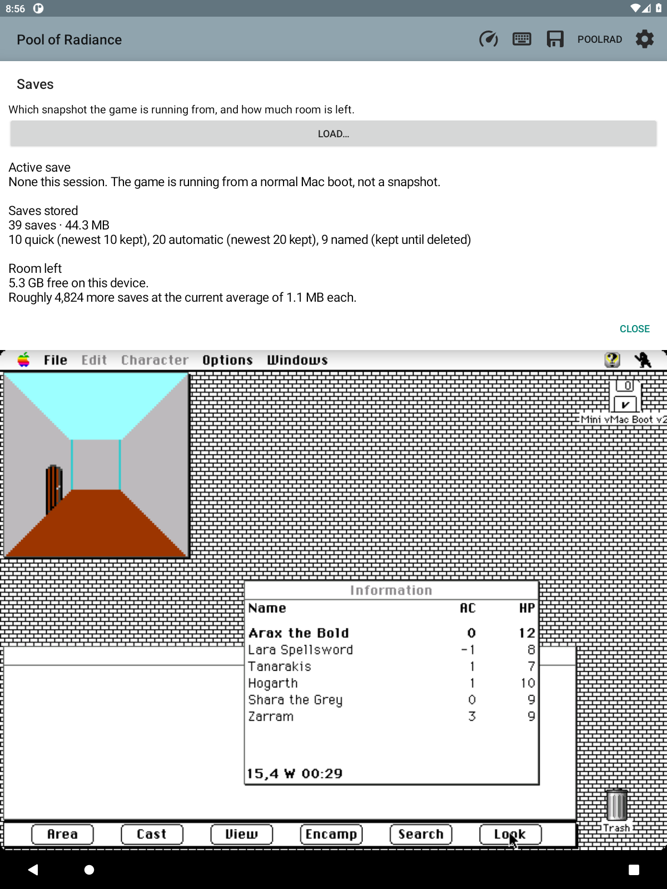

# Companion tabs

**Map**, **World**, and **Info** share the space above the original
Mac display. The keyboard stays below the game. Switching tabs never replaces,
pauses or restarts the emulator.

**Map** retains the map, flag pages and [compact party sidebar](PARTY.md):
HP bars, AC, class symbols and tap-for-details when there is room. The sidebar
collapses in narrow/short windows without reducing the guest's allocation.
Walked squares and recorded directional footprints stay with each notebook's
area; optional fog hides unvisited geometry without changing the original game.
**World** joins areas from recorded travel into a map you can drag and zoom.
Tap an area to see its crossings. [World guide](WORLD.md).

**Info** opens tools such as Saves, the message log, Journal, and reference
tables. Each page fits above the game. Lists scroll within that space;
**Close** returns to Info. [Exploration trail](EXPLORATION.md) controls fog,
footprints and the recent route.

The PoolRad menu includes **Show companion**, **Notebooks**, **Screenshot**
and **Desktop appearance**. Keyboard, disk/import and Settings keep their
existing toolbar locations. Capture RAM remains absent. Opening Notebooks or
Desktop appearance while the companion is hidden reveals it first.

## State and input

- The old hidden-map preference migrates once to `poolrad_show_companion`.
  Hide/show retains the selected tab; its checkmark describes the whole pane.
- A fresh session starts on Map. Activity/fragment saved state carries stable
  `map`/`world`/`info` IDs through restoration. The old `connections` ID
  opens World; unknown IDs fall back to Map.
- One `LiveMapView` and notebook controller stay mounted across tab changes.
  Map/party polling and eligible exploration recording continue while the
  activity is resumed, including on Info or with the companion hidden. Tab
  selection and hide/show do not reset the trail or its sampling continuity.
  Backgrounding or destroying the activity stops sampling and breaks
  continuity; stale live arrow/HP claims are cleared while geometry and saved
  coverage remain. Resuming requests fresh samples. Old-generation and
  old-core callbacks are rejected. The [exploration guide](EXPLORATION.md)
  explains which game states can authorize a recorded step.
- Automatic code-wheel recognition remains independent of tab selection.
  Manual code entry retains its existing dialog host and ordinary keystrokes.
- Companion touches stay in the pane. Controls do not take hardware-key focus
  from the guest; Android accessibility still exposes labelled, selected tabs.
- Screenshot captures the selected embedded tab, guest and optional keyboard.
  Separate reference-dialog windows and system bars are not in that image.

## Implementation

`CompanionPane` owns the three retained pages. `MapStackLayout` allocates the old
upper-space budget to that direct child, including its 48dp tab row. It never
casts the nested map's frame-layout parameters or changes the guest siblings.
`EmulatorFragment` owns selection, polling and preference migration; `MiniVMac`
carries saved selection through its existing replacement-fragment startup flow.

`CompanionDialogBounds` sizes reference dialogs and all code-wheel pickers from
the actual visible pane, including toolbar/system offsets. It tracks host/pane
layout changes and removes its listeners on dismissal. An existing hidden or
removed pane fails closed; only callers without a companion use the old
half-window fallback. No dimming or opening animation is added.

## Scope and verification

The original UI1 slice now includes [Journal](JOURNAL.md) as a working Info
tool: private-book import, numbered lookup, illustrations and bookmarks.
Open handwritten pages from Map or **Info → Notes index**.
Native session recovery after forced activity recreation is the separate Q1
backlog item, not a benefit claimed for tab restoration.

Run the Java unit suite, `java tools/CompanionLifecycleCheck.java`, and the
Android View probe documented in `tools/CompanionPaneCheck.java`. The latter
checks retained views, contrast, scrolling, touch consumption and actual parent
layout with keyboard/portrait/landscape/narrow sizes; it is not a device test.
Live window/input checks and limitations are recorded in
[local acceptance](LOCAL_TESTING.md). Physical e-ink/stylus acceptance remains
untested by these software checks.

## Pages stay out of the game's way (2026-09-20)

Every bounded companion page (Info tools, Load…, the rest confirmation) is
placed above the guest by `CompanionDialogBounds`, and since 0.109.0 it is
also not touch-modal: a touch outside the page reaches the game below while
the page stays open. Keys still go to the page, and tapping outside does not
close it. The player can read Money or Saves and keep walking.

*Development-build capture from the 0.109.0 touch test. The game clock advanced
while Saves remained open.*
