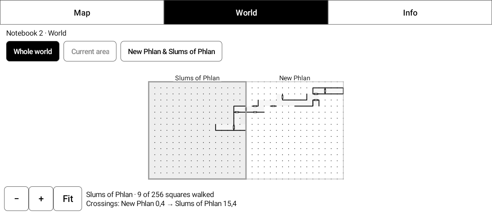
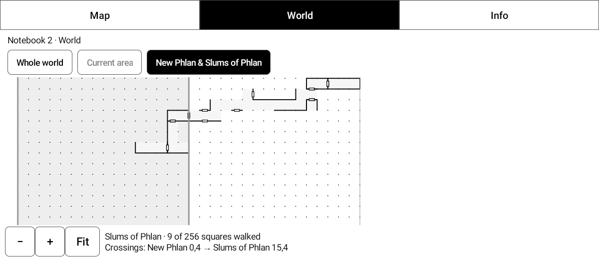

# World — the discovered areas as one map (F105, 0.113.0)

**World**, beside **Map**, shows every area the party has discovered, fitted
together as one map you can drag and pinch. It replaces the Connections tab.
The data underneath is unchanged: the same recorded crossings described in
[AREA_CONNECTIONS.md](AREA_CONNECTIONS.md) and the same remembered exploration
each area's Map already keeps. World reads nothing from game data; an area
appears only once the party has been there, and only its walked squares are
drawn.

## How areas are placed

- **Stitched.** A crossing whose two squares sit on facing map borders (New
  Phlan 0,4 west into the Slums at 15,4) puts the two areas edge to edge, rows
  aligned by the crossing squares. Phlan's districts therefore read as one
  city. A return trip through the same gate is the same seam, not a second
  drawing.
- **Islands.** Stairs, boats and teleports land on interior squares, so those
  areas cannot be adjacent. The far area is placed as its own island near the
  place it was reached from, and the crossing is drawn as a dotted link from
  the exact departure square (a dot) to the exact arrival square (an arrow).
- **Conflicts never overlap.** If a border crossing would put an area on top
  of one already placed, or would place the same area in two spots, the first
  placement stands and the later crossing is drawn as a link instead.
- **Separate places.** Areas with no recorded crossing to the party's part of
  the world (caves reached across the wilderness, which is not an identified
  area) are shelved in their own band under a small caption saying so. World
  does not invent the overworld or a route across it.

The layout lives in `mapper/WorldLayout.java` and is pure Java: seeds from the
party's area, grows each stitched cluster breadth-first, then shelves clusters
left to right with wraps, walking links so joined islands sit near each other.
`WorldLayoutTest` covers the gate seam, row offsets, north/south seams, return
trips, stairs, overlap and inconsistency fallbacks, shelving, separate bands
and area-ID parsing.

## Using it

- **Chip row.** *Whole world* fits everything. *Current area* selects and
  frames the party's area. Then one chip per place: a stitched city is named
  for its best-joined district (*New Phlan & Slums of Phlan*, *New Phlan +2*),
  an island by its own name. Tapping a chip animates the board to that place
  (260 ms), so switching between places is a move across one map, not a page
  change.
- **Board.** Drag to pan, pinch or use **−**/**+** to zoom, **Fit** for the
  whole world. Tap an area to select it: the footer names it, says how many of
  its 256 squares are walked, and lists its recorded crossings with squares,
  which is where the old Connections crossing list went. Double-tap an area to
  frame it. The party's area has a black border, its name carries *You are
  here*, and a marker with a facing tick stands on the party's square while the
  position is verified.
- **Live.** As the party walks, the current area's drawing updates from the
  same trail the Map tab draws; new crossings add areas and refit the board.
  Other areas draw from the notebook's remembered maps, read once per notebook.

Nothing on World sends input to the game or changes any file. All controls are
48 dp targets, none takes keyboard focus, and the board exposes zoom and
per-area selection as accessibility actions. A remembered *Connections* tab
selection from an older version opens World.

## Retired

`ConnectionsView` (the schematic box-and-arrow graph) is removed. The
crossing list survives in World's footer for the selected area. Connection
recording, storage (`connections.bin`), backups and the neighbor preview on
the Map tab are untouched.

## Verification — 2026-09-20

- 748 Java unit tests pass, twelve of them new `WorldLayoutTest` cases.
- `tools/render-check.sh WorldViewCheck` on the sandbox emulator: 6 of 6
  actual View checks pass (empty state, gate stitching with a linked island,
  chip and Fit focus targets, zoom limits and drag panning, accessible
  selection with footer crossings, phone-width layout).
- `tools/render-check.sh CompanionPaneCheck`: 10 of 10, including the World
  tab retained beside Map and Info and the legacy "connections" selection.
- Live on the sandbox emulator (Notebook 2, which recorded the 0.108.0 gate
  crossing): the World tab drew New Phlan and the Slums stitched at the gate
  row with the walked path continuing across the seam; tapping the Slums put
  "Slums of Phlan · 9 of 256 squares walked / Crossings: New Phlan 0,4 → Slums
  of Phlan 15,4" in the footer; the city chip took focus; + and a drag zoomed
  and panned the board.
- Not verified live: the party marker and *Current area* chip with a running
  game position (the sandbox's game was at its main menu, not in an area), and
  islands or separate bands with real crossings (no stairs or boat crossing is
  recorded in any notebook yet; both are covered by unit tests and the render
  check). `tools/check-connections.sh` (instrumentation) was updated to assert
  through the World board but not run: it needs a disposable app with no disks
  and no notebooks.

